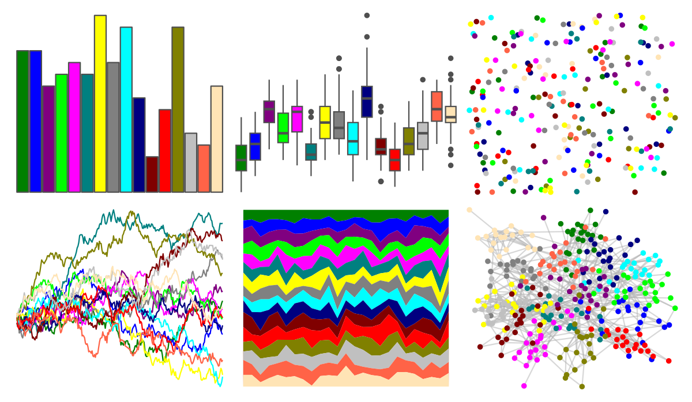

# miscpalettes - bright 

::: columns
::: {.column width="50%"}

**Github**

[EmilHvitfeldt/miscpalettes](https://github.com/EmilHvitfeldt/miscpalettes)
:::

::: {.column width="50%"}

**CRAN**

Not on CRAN
:::
:::

<hr> 

Use with [paletteer](https://emilhvitfeldt.github.io/paletteer/) package:

```r
library(paletteer)
paletteer_d("miscpalettes::bright")
```

Use raw:

```r
c("#008000FF", "#0000FFFF", "#800080FF", "#00FF00FF", "#FF00FFFF", "#008080FF", "#FFFF00FF", "#808080FF", "#00FFFFFF", "#000080FF", "#800000FF", "#FF0000FF", "#808000FF", "#C0C0C0FF", "#FF6347FF", "#FFE4B5FF")
``` 

 

<br>

# Related Palettes

<div class="list" style="display: grid; grid-template-columns: auto auto auto;"> <figure class="figure">
<a href="../../awtools/a_palette/"> </a>
</figure> <figure class="figure">
<a href="../../ggthemes/stata_s1rcolor/"> </a>
</figure> <figure class="figure">
<a href="../../ggthemes/stata_s1color/"> </a>
</figure> <figure class="figure">
<a href="../../miscpalettes/semiTransparent/"> </a>
</figure> <figure class="figure">
<a href="../../colorBlindness/paletteMartin/"> </a>
</figure> <figure class="figure">
<a href="../../ggprism/colors/"> </a>
</figure> <figure class="figure">
<a href="../../miscpalettes/excel/"> </a>
</figure> <figure class="figure">
<a href="../../tidyquant/tq_dark/"> </a>
</figure> <figure class="figure">
<a href="../../awtools/bpalette/"> </a>
</figure> <figure class="figure">
<a href="../../tidyquant/tq_green/"> </a>
</figure> <figure class="figure">
<a href="../../pals/watlington/"> </a>
</figure> <figure class="figure">
<a href="../../basetheme/ink/"> </a>
</figure> 
</div>
