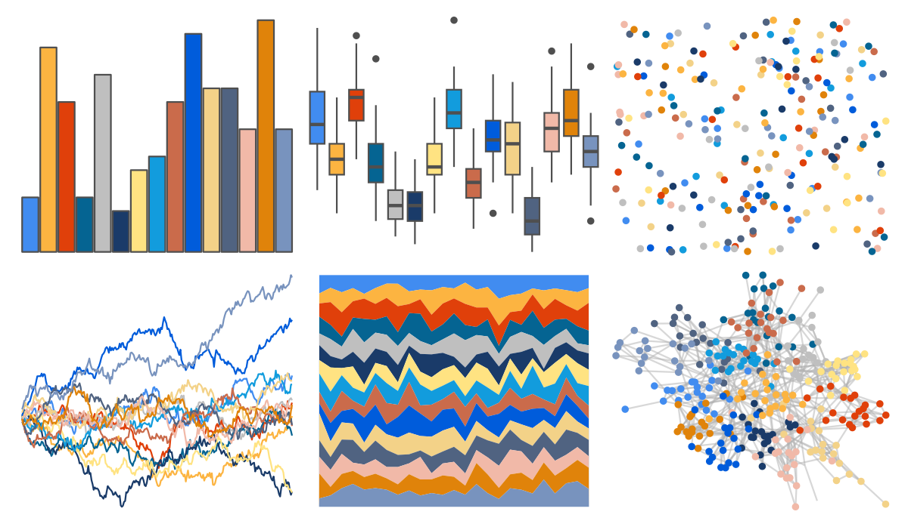

# miscpalettes - brightPastel 

::: columns
::: {.column width="50%"}

**Github**

[EmilHvitfeldt/miscpalettes](https://github.com/EmilHvitfeldt/miscpalettes)
:::

::: {.column width="50%"}

**CRAN**

Not on CRAN
:::
:::

<hr> 

Use with [paletteer](https://emilhvitfeldt.github.io/paletteer/) package:

```r
library(paletteer)
paletteer_d("miscpalettes::brightPastel")
```

Use raw:

```r
c("#418CF0FF", "#FCB441FF", "#E0400AFF", "#056492FF", "#BFBFBFFF", "#1A3B69FF", "#FFE382FF", "#129CDDFF", "#CA6B4BFF", "#005CDBFF", "#F3D288FF", "#506381FF", "#F1B9A8FF", "#E0830AFF", "#7893BEFF")
``` 

 

<br>

# Related Palettes

<div class="list" style="display: grid; grid-template-columns: auto auto auto;"> <figure class="figure">
<a href="../../amerika/Dem_Ind_Rep3/"> </a>
</figure> <figure class="figure">
<a href="../../palettetown/gloom/"> </a>
</figure> <figure class="figure">
<a href="../../palettetown/quilava/"> </a>
</figure> <figure class="figure">
<a href="../../palettetown/lanturn/"> </a>
</figure> <figure class="figure">
<a href="../../palettetown/totodile/"> </a>
</figure> <figure class="figure">
<a href="../../palettetown/croconaw/"> </a>
</figure> <figure class="figure">
<a href="../../palettetown/cyndaquil/"> </a>
</figure> <figure class="figure">
<a href="../../palettetown/lapras/"> </a>
</figure> <figure class="figure">
<a href="../../palettetown/vileplume/"> </a>
</figure> <figure class="figure">
<a href="../../palettetown/feraligatr/"> </a>
</figure> <figure class="figure">
<a href="../../ggthemes/stata_s2color/"> </a>
</figure> <figure class="figure">
<a href="../../palettetown/ledian/"> </a>
</figure> 
</div>
