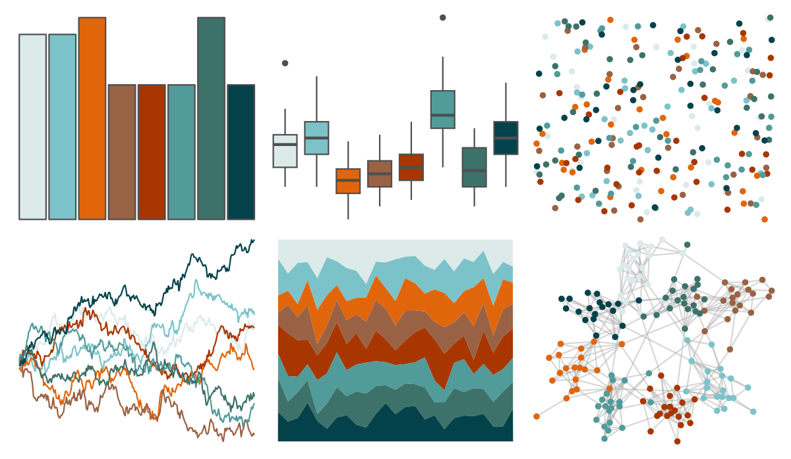

# miscpalettes - dreaming 

::: columns
::: {.column width="50%"}

**Github**

[EmilHvitfeldt/miscpalettes](https://github.com/EmilHvitfeldt/miscpalettes)
:::

::: {.column width="50%"}

**CRAN**

Not on CRAN
:::
:::

<hr> 

Use with [paletteer](https://emilhvitfeldt.github.io/paletteer/) package:

```r
library(paletteer)
paletteer_d("miscpalettes::dreaming")
```

Use raw:

```r
c("#DCEAEAFF", "#7CC3C9FF", "#E1650BFF", "#996244FF", "#A83600FF", "#519B9AFF", "#3D726AFF", "#03424BFF")
``` 

 

<br>

# Related Palettes

<div class="list" style="display: grid; grid-template-columns: auto auto auto;"> <figure class="figure">
<a href="../../awtools/a_palette/"> </a>
</figure> <figure class="figure">
<a href="../../ButterflyColors/hamadryas_feronia/"> </a>
</figure> <figure class="figure">
<a href="../../ButterflyColors/hamadryas_feronia/"> </a>
</figure> <figure class="figure">
<a href="../../ggsci/nrc_npg/"> </a>
</figure> <figure class="figure">
<a href="../../beyonce/X75/"> </a>
</figure> <figure class="figure">
<a href="../../palettetown/goldeen/"> </a>
</figure> <figure class="figure">
<a href="../../ggthemr/light/"> </a>
</figure> <figure class="figure">
<a href="../../ggsci/light_uchicago/"> </a>
</figure> <figure class="figure">
<a href="../../PrettyCols/TangerineBlues/"> </a>
</figure> <figure class="figure">
<a href="../../MexBrewer/Revolucion/"> </a>
</figure> <figure class="figure">
<a href="../../Redmonder/qMSOAsp/"> </a>
</figure> <figure class="figure">
<a href="../../palettetown/azumarill/"> </a>
</figure> 
</div>
