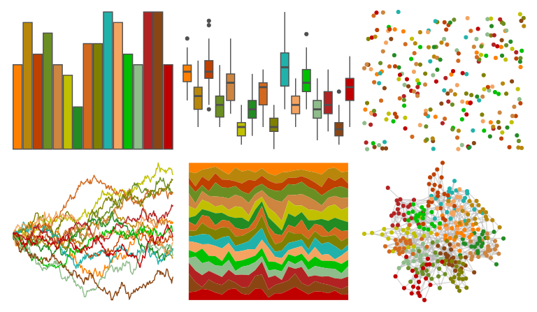

# miscpalettes - earthTones 

::: columns
::: {.column width="50%"}

**Github**

[EmilHvitfeldt/miscpalettes](https://github.com/EmilHvitfeldt/miscpalettes)
:::

::: {.column width="50%"}

**CRAN**

Not on CRAN
:::
:::

<hr> 

Use with [paletteer](https://emilhvitfeldt.github.io/paletteer/) package:

```r
library(paletteer)
paletteer_d("miscpalettes::earthTones")
```

Use raw:

```r
c("#FF8000FF", "#B8860BFF", "#C04000FF", "#6B8E23FF", "#CD853FFF", "#C0C000FF", "#228B22FF", "#D2691EFF", "#808000FF", "#20B2AAFF", "#F4A460FF", "#00C000FF", "#8FBC8BFF", "#B22222FF", "#8B4513FF", "#C00000FF")
``` 

 

<br>

# Related Palettes

<div class="list" style="display: grid; grid-template-columns: auto auto auto;"> <figure class="figure">
<a href="../../awtools/a_palette/"> </a>
</figure> <figure class="figure">
<a href="../../tvthemes/parksAndRec/"> </a>
</figure> <figure class="figure">
<a href="../../palettetown/ho_oh/"> </a>
</figure> <figure class="figure">
<a href="../../palettetown/raichu/"> </a>
</figure> <figure class="figure">
<a href="../../beyonce/X72/"> </a>
</figure> <figure class="figure">
<a href="../../palettetown/weepinbell/"> </a>
</figure> <figure class="figure">
<a href="../../palettetown/moltres/"> </a>
</figure> <figure class="figure">
<a href="../../impressionist.colors/la_sieste/"> </a>
</figure> <figure class="figure">
<a href="../../ggthemes/Traffic/"> </a>
</figure> <figure class="figure">
<a href="../../palettetown/charmander/"> </a>
</figure> <figure class="figure">
<a href="../../palettetown/bellsprout/"> </a>
</figure> <figure class="figure">
<a href="../../palettetown/smeargle/"> </a>
</figure> 
</div>
