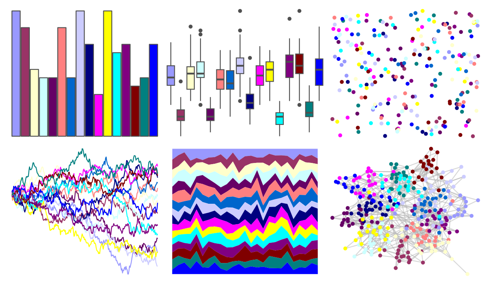
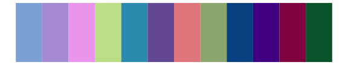

# miscpalettes - excel 

::: columns
::: {.column width="50%"}

**Github**

[EmilHvitfeldt/miscpalettes](https://github.com/EmilHvitfeldt/miscpalettes)
:::

::: {.column width="50%"}

**CRAN**

Not on CRAN
:::
:::

<hr> 

Use with [paletteer](https://emilhvitfeldt.github.io/paletteer/) package:

```r
library(paletteer)
paletteer_d("miscpalettes::excel")
```

Use raw:

```r
c("#9999FFFF", "#993366FF", "#FFFFCCFF", "#CCFFFFFF", "#660066FF", "#FF8080FF", "#0066CCFF", "#CCCCFFFF", "#000080FF", "#FF00FFFF", "#FFFF00FF", "#00FFFFFF", "#800080FF", "#800000FF", "#008080FF", "#0000FFFF")
``` 

 

<br>

# Related Palettes

<div class="list" style="display: grid; grid-template-columns: auto auto auto;"> <figure class="figure">
<a href="../../amerika/Dem_Ind_Rep3/"> </a>
</figure> <figure class="figure">
<a href="../../miscpalettes/bright/"> </a>
</figure> <figure class="figure">
<a href="../../tvthemes/CrystalGems/"> </a>
</figure> <figure class="figure">
<a href="../../jcolors/pal8/"> </a>
</figure> <figure class="figure">
<a href="../../ggsci/aussie_flatui/"> </a>
</figure> <figure class="figure">
<a href="../../ggprism/floral2/"> </a>
</figure> <figure class="figure">
<a href="../../miscpalettes/semiTransparent/"> </a>
</figure> <figure class="figure">
<a href="../../pals/tol/"> </a>
</figure> <figure class="figure">
<a href="../../palettesForR/Paintjet/"> </a>
</figure> <figure class="figure">
<a href="../../colorBlindness/paletteMartin/"> </a>
</figure> <figure class="figure">
<a href="../../rcartocolor/Safe/"> </a>
</figure> <figure class="figure">
<a href="../../ggthemes/stata_s1rcolor/"> </a>
</figure> 
</div>
