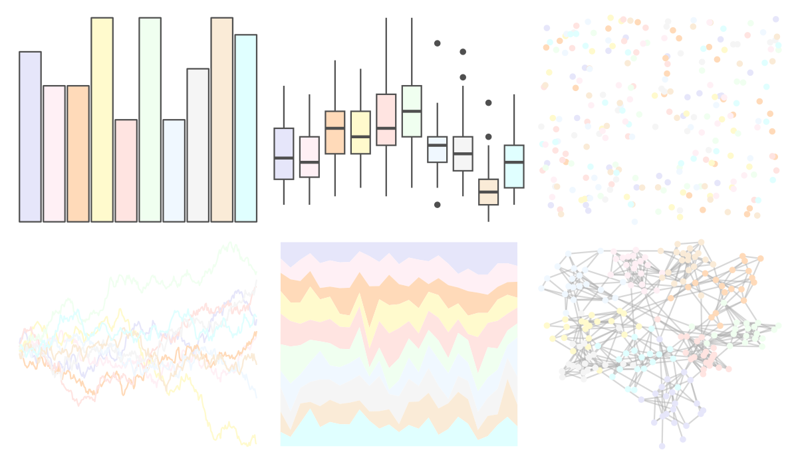

# miscpalettes - light 

::: columns
::: {.column width="50%"}

**Github**

[EmilHvitfeldt/miscpalettes](https://github.com/EmilHvitfeldt/miscpalettes)
:::

::: {.column width="50%"}

**CRAN**

Not on CRAN
:::
:::

<hr> 

Use with [paletteer](https://emilhvitfeldt.github.io/paletteer/) package:

```r
library(paletteer)
paletteer_d("miscpalettes::light")
```

Use raw:

```r
c("#E6E6FAFF", "#FFF0F5FF", "#FFDAB9FF", "#FFFACDFF", "#FFE4E1FF", "#F0FFF0FF", "#F0F8FFFF", "#F5F5F5FF", "#FAEBD7FF", "#E0FFFFFF")
``` 

 

<br>

# Related Palettes

<div class="list" style="display: grid; grid-template-columns: auto auto auto;"> <figure class="figure">
<a href="../../amerika/Dem_Ind_Rep3/"> </a>
</figure> <figure class="figure">
<a href="../../RColorBrewer/Pastel2/"> </a>
</figure> <figure class="figure">
<a href="../../RColorBrewer/Pastel1/"> </a>
</figure> <figure class="figure">
<a href="../../khroma/pale/"> </a>
</figure> <figure class="figure">
<a href="../../PrettyCols/Spring/"> </a>
</figure> <figure class="figure">
<a href="../../tvthemes/MegaPearl/"> </a>
</figure> <figure class="figure">
<a href="../../yarrr/ipod/"> </a>
</figure> <figure class="figure">
<a href="../../ghibli/PonyoLight/"> </a>
</figure> <figure class="figure">
<a href="../../ggthemes/Classic_10_Light/"> </a>
</figure> <figure class="figure">
<a href="../../ltc/paloma/"> </a>
</figure> <figure class="figure">
<a href="../../fishualize/Lycengraulis_grossidens/"> </a>
</figure> <figure class="figure">
<a href="../../ghibli/MarnieLight1/"> </a>
</figure> 
</div>
