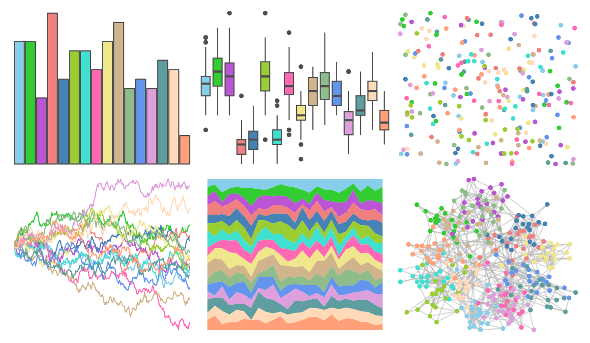

# miscpalettes - pastel 

::: columns
::: {.column width="50%"}

**Github**

[EmilHvitfeldt/miscpalettes](https://github.com/EmilHvitfeldt/miscpalettes)
:::

::: {.column width="50%"}

**CRAN**

Not on CRAN
:::
:::

<hr> 

Use with [paletteer](https://emilhvitfeldt.github.io/paletteer/) package:

```r
library(paletteer)
paletteer_d("miscpalettes::pastel")
```

Use raw:

```r
c("#87CEEBFF", "#32CD32FF", "#BA55D3FF", "#F08080FF", "#4682B4FF", "#9ACD32FF", "#40E0D0FF", "#FF69B4FF", "#F0E68CFF", "#D2B48CFF", "#8FBC8BFF", "#6495EDFF", "#DDA0DDFF", "#5F9EA0FF", "#FFDAB9FF", "#FFA07AFF")
``` 

 

<br>

# Related Palettes

<div class="list" style="display: grid; grid-template-columns: auto auto auto;"> <figure class="figure">
<a href="../../awtools/a_palette/"> </a>
</figure> <figure class="figure">
<a href="../../ButterflyColors/hamadryas_feronia/"> </a>
</figure> <figure class="figure">
<a href="../../ButterflyColors/hamadryas_feronia/"> </a>
</figure> <figure class="figure">
<a href="../../palettesForR/Pastels/"> </a>
</figure> <figure class="figure">
<a href="../../ggthemes/Classic_20/"> </a>
</figure> <figure class="figure">
<a href="../../ggsci/category20_d3/"> </a>
</figure> <figure class="figure">
<a href="../../ggsci/schwifty_rickandmorty/"> </a>
</figure> <figure class="figure">
<a href="../../tidyquant/tq_dark/"> </a>
</figure> <figure class="figure">
<a href="../../vapeplot/vaporwave/"> </a>
</figure> <figure class="figure">
<a href="../../basetheme/brutal/"> </a>
</figure> <figure class="figure">
<a href="../../basetheme/dark/"> </a>
</figure> <figure class="figure">
<a href="../../trekcolors/lcars_alt/"> </a>
</figure> 
</div>
