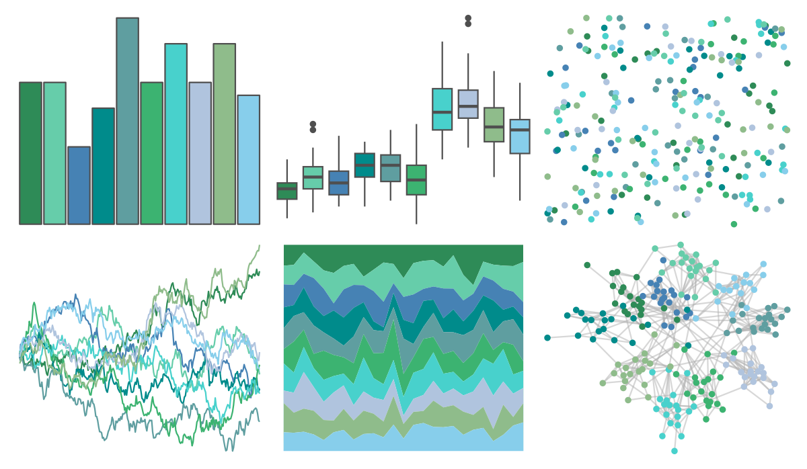

# miscpalettes - seaGreen 

::: columns
::: {.column width="50%"}

**Github**

[EmilHvitfeldt/miscpalettes](https://github.com/EmilHvitfeldt/miscpalettes)
:::

::: {.column width="50%"}

**CRAN**

Not on CRAN
:::
:::

<hr> 

Use with [paletteer](https://emilhvitfeldt.github.io/paletteer/) package:

```r
library(paletteer)
paletteer_d("miscpalettes::seaGreen")
```

Use raw:

```r
c("#2E8B57FF", "#66CDAAFF", "#4682B4FF", "#008B8BFF", "#5F9EA0FF", "#3CB371FF", "#48D1CCFF", "#B0C4DEFF", "#8FBC8BFF", "#87CEEBFF")
``` 

 

<br>

# Related Palettes

<div class="list" style="display: grid; grid-template-columns: auto auto auto;"> <figure class="figure">
<a href="../../amerika/Dem_Ind_Rep3/"> </a>
</figure> <figure class="figure">
<a href="../../Redmonder/qMSOBu2/"> </a>
</figure> <figure class="figure">
<a href="../../rcartocolor/Mint/"> </a>
</figure> <figure class="figure">
<a href="../../trekcolors/romulan2/"> </a>
</figure> <figure class="figure">
<a href="../../Redmonder/sPBIGn/"> </a>
</figure> <figure class="figure">
<a href="../../PrettyCols/Teals/"> </a>
</figure> <figure class="figure">
<a href="../../ggthemes/excel_Blue_II/"> </a>
</figure> <figure class="figure">
<a href="../../ggthemes/excel_Savon/"> </a>
</figure> <figure class="figure">
<a href="../../ggthemes/excel_Integral/"> </a>
</figure> <figure class="figure">
<a href="../../NineteenEightyR/youngturqs/"> </a>
</figure> <figure class="figure">
<a href="../../ggsci/teal_material/"> </a>
</figure> <figure class="figure">
<a href="../../RColorBrewer/GnBu/"> </a>
</figure> 
</div>
