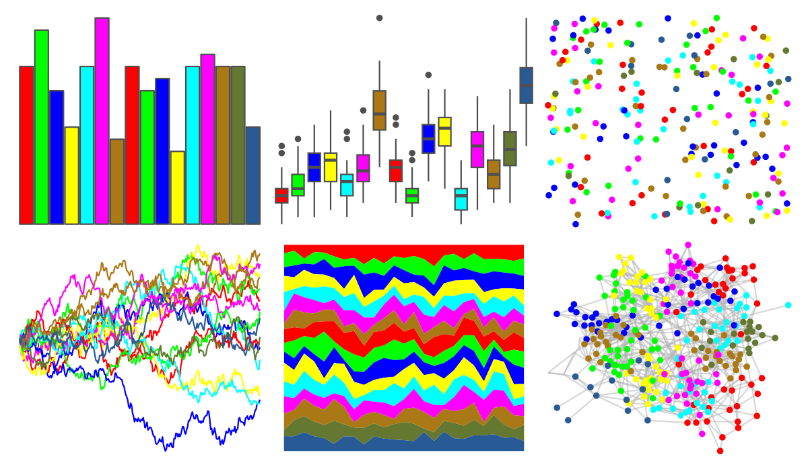
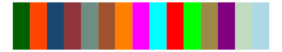
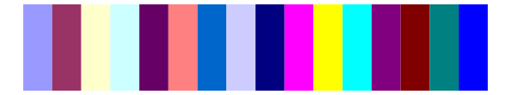
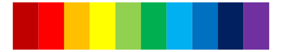

# miscpalettes - semiTransparent 

::: columns
::: {.column width="50%"}

**Github**

[EmilHvitfeldt/miscpalettes](https://github.com/EmilHvitfeldt/miscpalettes)
:::

::: {.column width="50%"}

**CRAN**

Not on CRAN
:::
:::

<hr> 

Use with [paletteer](https://emilhvitfeldt.github.io/paletteer/) package:

```r
library(paletteer)
paletteer_d("miscpalettes::semiTransparent")
```

Use raw:

```r
c("#FF0000FF", "#00FF00FF", "#0000FFFF", "#FFFF00FF", "#00FFFFFF", "#FF00FFFF", "#AA7814FF", "#FF0000FF", "#00FF00FF", "#0000FFFF", "#FFFF00FF", "#00FFFFFF", "#FF00FFFF", "#AA7814FF", "#647832FF", "#285A96FF")
``` 

 

<br>

# Related Palettes

<div class="list" style="display: grid; grid-template-columns: auto auto auto;"> <figure class="figure">
<a href="../../awtools/a_palette/"> </a>
</figure> <figure class="figure">
<a href="../../miscpalettes/bright/"> </a>
</figure> <figure class="figure">
<a href="../../ggthemes/stata_s1rcolor/"> </a>
</figure> <figure class="figure">
<a href="../../basetheme/ink/"> </a>
</figure> <figure class="figure">
<a href="../../ggthemes/stata_s1color/"> </a>
</figure> <figure class="figure">
<a href="../../ggprism/stained_glass2/"> </a>
</figure> <figure class="figure">
<a href="../../ggprism/stained_glass/"> </a>
</figure> <figure class="figure">
<a href="../../miscpalettes/excel/"> </a>
</figure> <figure class="figure">
<a href="../../tidyquant/tq_dark/"> </a>
</figure> <figure class="figure">
<a href="../../jcolors/pal8/"> </a>
</figure> <figure class="figure">
<a href="../../basetheme/deepblue/"> </a>
</figure> <figure class="figure">
<a href="../../Redmonder/qMSOStd/"> </a>
</figure> 
</div>
