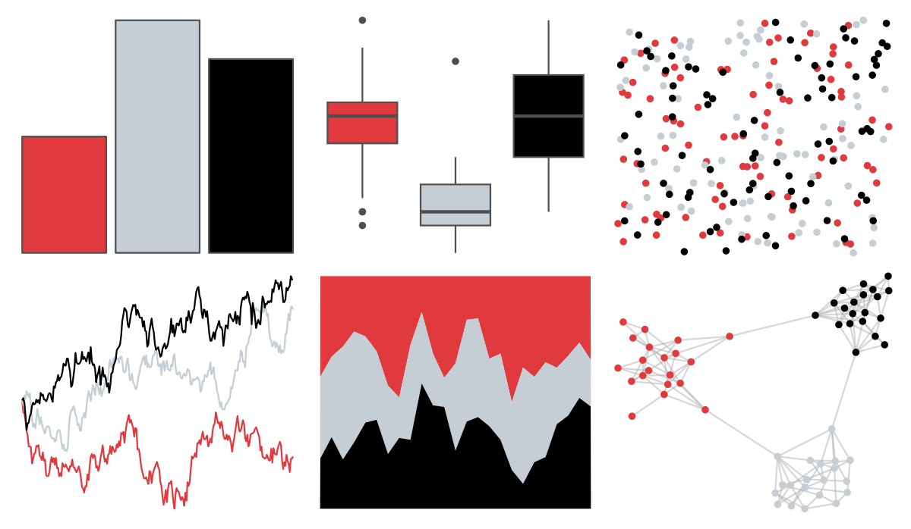

# nbapalettes - blazers 

::: columns
::: {.column width="50%"}

**Github**

[murrayjw/nbapalettes](https://github.com/murrayjw/nbapalettes)
:::

::: {.column width="50%"}

**CRAN**

[nbapalettes](https://CRAN.R-project.org/package=nbapalettes)
:::
:::

<hr> 

Use with [paletteer](https://emilhvitfeldt.github.io/paletteer/) package:

```r
library(paletteer)
paletteer_d("nbapalettes::blazers")
```

Use raw:

```r
c("#E13A3EFF", "#C4CED4FF", "#000000FF")
``` 

 

<br>

# Related Palettes

<div class="list" style="display: grid; grid-template-columns: auto auto auto;"> <figure class="figure">
<a href="../../awtools/a_palette/"> </a>
</figure> <figure class="figure">
<a href="../../nbapalettes/hawks/"> </a>
</figure> <figure class="figure">
<a href="../../nbapalettes/clippers/"> </a>
</figure> <figure class="figure">
<a href="../../nbapalettes/hawks_90s/"> </a>
</figure> <figure class="figure">
<a href="../../nbapalettes/heat/"> </a>
</figure> <figure class="figure">
<a href="../../nbapalettes/wizards_city/"> </a>
</figure> <figure class="figure">
<a href="../../tvthemes/Tully/"> </a>
</figure> <figure class="figure">
<a href="../../nbapalettes/heat_90s/"> </a>
</figure> <figure class="figure">
<a href="../../nbapalettes/heat_vice/"> </a>
</figure> <figure class="figure">
<a href="../../nbapalettes/bucks_00s/"> </a>
</figure> <figure class="figure">
<a href="../../wesanderson/Darjeeling2/"> </a>
</figure> <figure class="figure">
<a href="../../fishualize/Centropyge_loricula/"> </a>
</figure> 
</div>
