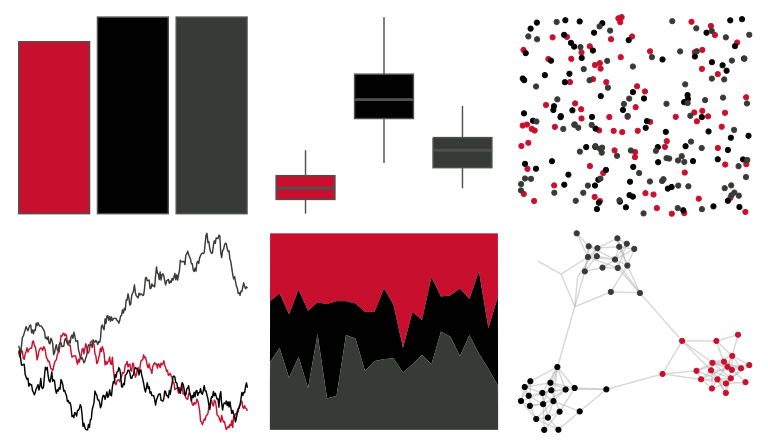

# nbapalettes - blazers_statement 

::: columns
::: {.column width="50%"}

**Github**

[murrayjw/nbapalettes](https://github.com/murrayjw/nbapalettes)
:::

::: {.column width="50%"}

**CRAN**

[nbapalettes](https://CRAN.R-project.org/package=nbapalettes)
:::
:::

<hr> 

Use with [paletteer](https://emilhvitfeldt.github.io/paletteer/) package:

```r
library(paletteer)
paletteer_d("nbapalettes::blazers_statement")
```

Use raw:

```r
c("#C8102EFF", "#010101FF", "#373A36FF")
``` 

 

<br>

# Related Palettes

<div class="list" style="display: grid; grid-template-columns: auto auto auto;"> <figure class="figure">
<a href="../../awtools/a_palette/"> </a>
</figure> <figure class="figure">
<a href="../../nbapalettes/raptors_statement/"> </a>
</figure> <figure class="figure">
<a href="../../nbapalettes/mavericks_retro/"> </a>
</figure> <figure class="figure">
<a href="../../nbapalettes/knicks_retro/"> </a>
</figure> <figure class="figure">
<a href="../../nbapalettes/wizards/"> </a>
</figure> <figure class="figure">
<a href="../../nbapalettes/kings/"> </a>
</figure> <figure class="figure">
<a href="../../nbapalettes/kings_alt2/"> </a>
</figure> <figure class="figure">
<a href="../../nbapalettes/blazers_city2/"> </a>
</figure> <figure class="figure">
<a href="../../ggsci/hallmarks_dark_cosmic/"> </a>
</figure> <figure class="figure">
<a href="../../beyonce/X4/"> </a>
</figure> <figure class="figure">
<a href="../../beyonce/X8/"> </a>
</figure> <figure class="figure">
<a href="../../nbapalettes/bulls_city2/"> </a>
</figure> 
</div>
