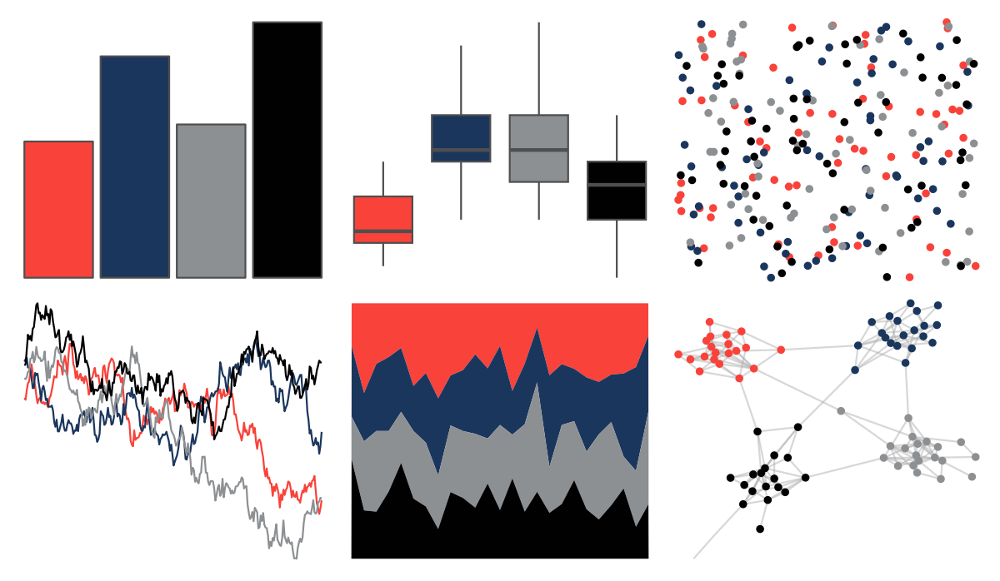

# nbapalettes - bobcats_original 

::: columns
::: {.column width="50%"}

**Github**

[murrayjw/nbapalettes](https://github.com/murrayjw/nbapalettes)
:::

::: {.column width="50%"}

**CRAN**

[nbapalettes](https://CRAN.R-project.org/package=nbapalettes)
:::
:::

<hr> 

Use with [paletteer](https://emilhvitfeldt.github.io/paletteer/) package:

```r
library(paletteer)
paletteer_d("nbapalettes::bobcats_original")
```

Use raw:

```r
c("#F9423AFF", "#1B365DFF", "#8D9093FF", "#010101FF")
``` 

 

<br>

# Related Palettes

<div class="list" style="display: grid; grid-template-columns: auto auto auto;"> <figure class="figure">
<a href="../../awtools/a_palette/"> </a>
</figure> <figure class="figure">
<a href="../../ButterflyColors/hamadryas_feronia/"> </a>
</figure> <figure class="figure">
<a href="../../ButterflyColors/hamadryas_feronia/"> </a>
</figure> <figure class="figure">
<a href="../../nbapalettes/clippers_city/"> </a>
</figure> <figure class="figure">
<a href="../../nbapalettes/rockets/"> </a>
</figure> <figure class="figure">
<a href="../../nbapalettes/sixers/"> </a>
</figure> <figure class="figure">
<a href="../../nbapalettes/raptors_original/"> </a>
</figure> <figure class="figure">
<a href="../../nbapalettes/knicks_holiday/"> </a>
</figure> <figure class="figure">
<a href="../../nbapalettes/raptors/"> </a>
</figure> <figure class="figure">
<a href="../../nbapalettes/suns_00s/"> </a>
</figure> <figure class="figure">
<a href="../../nbapalettes/pistons_90s/"> </a>
</figure> <figure class="figure">
<a href="../../nbapalettes/kings_alt/"> </a>
</figure> 
</div>
