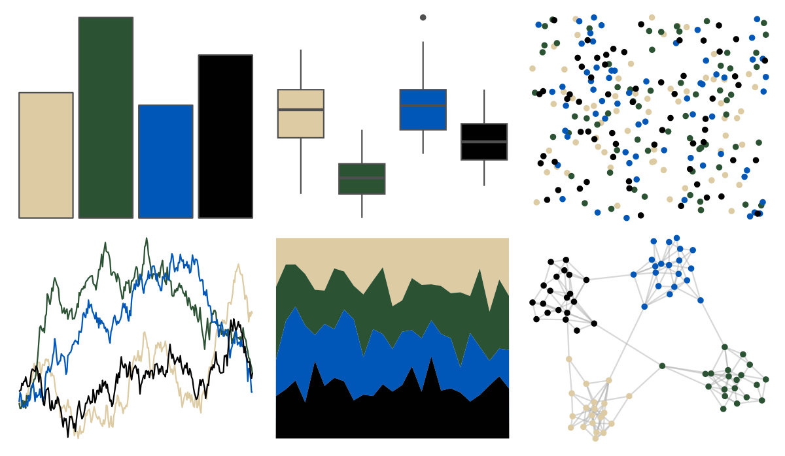

# nbapalettes - bucks_city 

::: columns
::: {.column width="50%"}

**Github**

[murrayjw/nbapalettes](https://github.com/murrayjw/nbapalettes)
:::

::: {.column width="50%"}

**CRAN**

[nbapalettes](https://CRAN.R-project.org/package=nbapalettes)
:::
:::

<hr> 

Use with [paletteer](https://emilhvitfeldt.github.io/paletteer/) package:

```r
library(paletteer)
paletteer_d("nbapalettes::bucks_city")
```

Use raw:

```r
c("#DDCBA4FF", "#2C5234FF", "#0057B7FF", "#010101FF")
``` 

 

<br>

# Related Palettes

<div class="list" style="display: grid; grid-template-columns: auto auto auto;"> <figure class="figure">
<a href="../../awtools/a_palette/"> </a>
</figure> <figure class="figure">
<a href="../../nbapalettes/pacers_venue/"> </a>
</figure> <figure class="figure">
<a href="../../ochRe/nolan_ned/"> </a>
</figure> <figure class="figure">
<a href="../../lisa/HilmaafKlint/"> </a>
</figure> <figure class="figure">
<a href="../../nbapalettes/timberwolves_00s/"> </a>
</figure> <figure class="figure">
<a href="../../nbapalettes/pistons_90s/"> </a>
</figure> <figure class="figure">
<a href="../../nbapalettes/raptors_europe/"> </a>
</figure> <figure class="figure">
<a href="../../nationalparkcolors/Acadia/"> </a>
</figure> <figure class="figure">
<a href="../../nbapalettes/magic_city2/"> </a>
</figure> <figure class="figure">
<a href="../../nbapalettes/mavericks_alt/"> </a>
</figure> <figure class="figure">
<a href="../../lisa/JacksonPollock/"> </a>
</figure> <figure class="figure">
<a href="../../rtist/pollock/"> </a>
</figure> 
</div>
