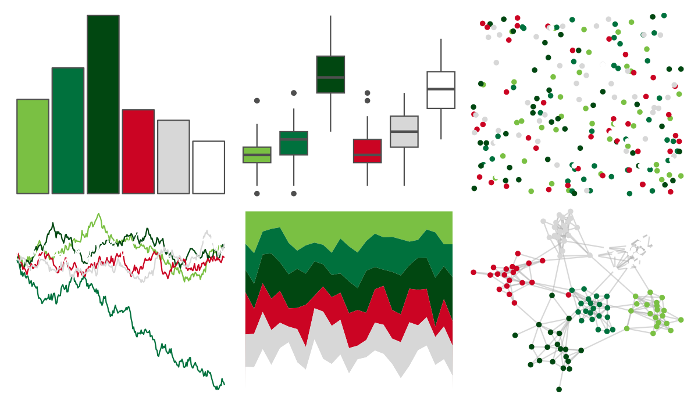

# nbapalettes - bucks_earned 

::: columns
::: {.column width="50%"}

**Github**

[murrayjw/nbapalettes](https://github.com/murrayjw/nbapalettes)
:::

::: {.column width="50%"}

**CRAN**

[nbapalettes](https://CRAN.R-project.org/package=nbapalettes)
:::
:::

<hr> 

Use with [paletteer](https://emilhvitfeldt.github.io/paletteer/) package:

```r
library(paletteer)
paletteer_d("nbapalettes::bucks_earned")
```

Use raw:

```r
c("#7AC043FF", "#00713DFF", "#014711FF", "#CB0423FF", "#D7D7D7FF", "#FFFFFFFF")
``` 

 

<br>

# Related Palettes

<div class="list" style="display: grid; grid-template-columns: auto auto auto;"> <figure class="figure">
<a href="../../amerika/Dem_Ind_Rep3/"> </a>
</figure> <figure class="figure">
<a href="../../futurevisions/earth/"> </a>
</figure> <figure class="figure">
<a href="../../palettetown/ivysaur/"> </a>
</figure> <figure class="figure">
<a href="../../colRoz/p_mitchelli/"> </a>
</figure> <figure class="figure">
<a href="../../ggsci/signature_substitutions_cosmic/"> </a>
</figure> <figure class="figure">
<a href="../../tayloRswift/taylorSwift/"> </a>
</figure> <figure class="figure">
<a href="../../ggthemes/fivethirtyeight/"> </a>
</figure> <figure class="figure">
<a href="../../yarrr/ohbrother/"> </a>
</figure> <figure class="figure">
<a href="../../palettetown/igglybuff/"> </a>
</figure> <figure class="figure">
<a href="../../palettetown/bulbasaur/"> </a>
</figure> <figure class="figure">
<a href="../../palettetown/machop/"> </a>
</figure> <figure class="figure">
<a href="../../ggthemr/carrot/"> </a>
</figure> 
</div>
