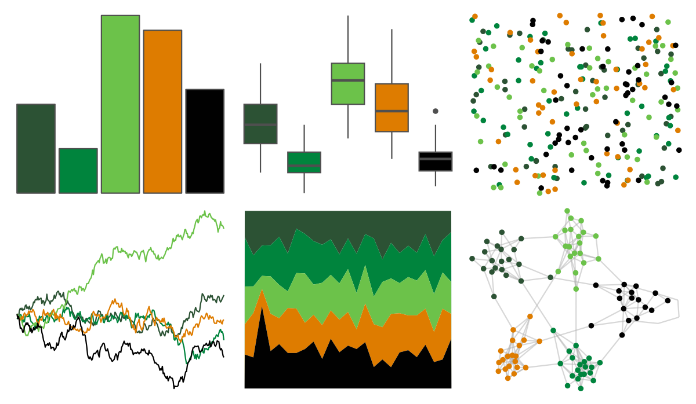

# nbapalettes - bucks_retro 

::: columns
::: {.column width="50%"}

**Github**

[murrayjw/nbapalettes](https://github.com/murrayjw/nbapalettes)
:::

::: {.column width="50%"}

**CRAN**

[nbapalettes](https://CRAN.R-project.org/package=nbapalettes)
:::
:::

<hr> 

Use with [paletteer](https://emilhvitfeldt.github.io/paletteer/) package:

```r
library(paletteer)
paletteer_d("nbapalettes::bucks_retro")
```

Use raw:

```r
c("#2C5234FF", "#00843DFF", "#6CC24AFF", "#DE7C00FF", "#010101FF")
``` 

 

<br>

# Related Palettes

<div class="list" style="display: grid; grid-template-columns: auto auto auto;"> <figure class="figure">
<a href="../../amerika/Dem_Ind_Rep3/"> </a>
</figure> <figure class="figure">
<a href="../../nbapalettes/celtics_champ/"> </a>
</figure> <figure class="figure">
<a href="../../rtist/davinci/"> </a>
</figure> <figure class="figure">
<a href="../../fishualize/Balistapus_undulatus/"> </a>
</figure> <figure class="figure">
<a href="../../lisa/Rembrandt/"> </a>
</figure> <figure class="figure">
<a href="../../wesanderson/Cavalcanti1/"> </a>
</figure> <figure class="figure">
<a href="../../poisonfrogs/Ashihuemoy/"> </a>
</figure> <figure class="figure">
<a href="../../DresdenColor/bloodrites/"> </a>
</figure> <figure class="figure">
<a href="../../lisa/Jean_MichelBasquiat_1/"> </a>
</figure> <figure class="figure">
<a href="../../poisonfrogs/Ptomopterna/"> </a>
</figure> <figure class="figure">
<a href="../../DresdenColor/provenguilty/"> </a>
</figure> <figure class="figure">
<a href="../../poisonfrogs/Mlaevigata/"> </a>
</figure> 
</div>
