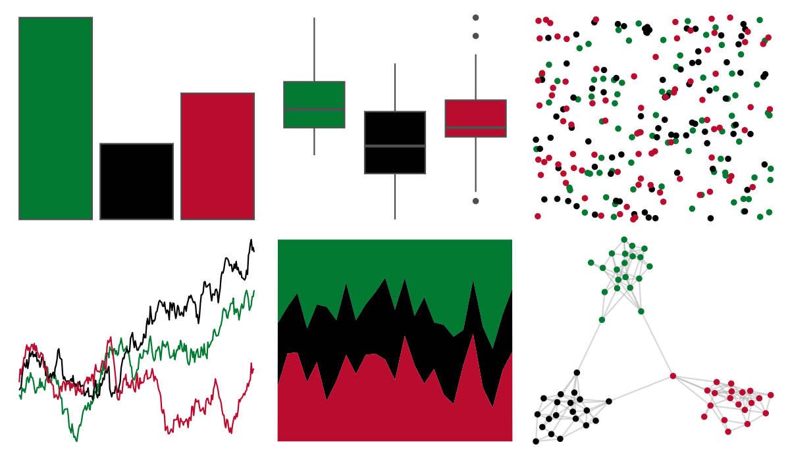

# nbapalettes - bulls_holiday 

::: columns
::: {.column width="50%"}

**Github**

[murrayjw/nbapalettes](https://github.com/murrayjw/nbapalettes)
:::

::: {.column width="50%"}

**CRAN**

[nbapalettes](https://CRAN.R-project.org/package=nbapalettes)
:::
:::

<hr> 

Use with [paletteer](https://emilhvitfeldt.github.io/paletteer/) package:

```r
library(paletteer)
paletteer_d("nbapalettes::bulls_holiday")
```

Use raw:

```r
c("#007A33FF", "#010101FF", "#BA0C2FFF")
``` 

 

<br>

# Related Palettes

<div class="list" style="display: grid; grid-template-columns: auto auto auto;"> <figure class="figure">
<a href="../../awtools/a_palette/"> </a>
</figure> <figure class="figure">
<a href="../../nbapalettes/celtics_europe/"> </a>
</figure> <figure class="figure">
<a href="../../nbapalettes/bulls_city2/"> </a>
</figure> <figure class="figure">
<a href="../../nbapalettes/rockets_original/"> </a>
</figure> <figure class="figure">
<a href="../../nbapalettes/supersonics/"> </a>
</figure> <figure class="figure">
<a href="../../nbapalettes/jazz/"> </a>
</figure> <figure class="figure">
<a href="../../nbapalettes/pelicans/"> </a>
</figure> <figure class="figure">
<a href="../../nbapalettes/warriors_cny/"> </a>
</figure> <figure class="figure">
<a href="../../nbapalettes/hawks_statement/"> </a>
</figure> <figure class="figure">
<a href="../../nbapalettes/celtics/"> </a>
</figure> <figure class="figure">
<a href="../../nbapalettes/lakers/"> </a>
</figure> <figure class="figure">
<a href="../../nbapalettes/cavaliers_90s/"> </a>
</figure> 
</div>
