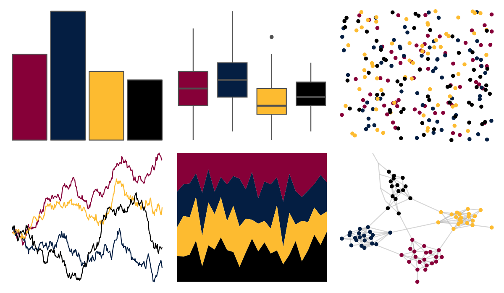

# nbapalettes - cavaliers 

::: columns
::: {.column width="50%"}

**Github**

[murrayjw/nbapalettes](https://github.com/murrayjw/nbapalettes)
:::

::: {.column width="50%"}

**CRAN**

[nbapalettes](https://CRAN.R-project.org/package=nbapalettes)
:::
:::

<hr> 

Use with [paletteer](https://emilhvitfeldt.github.io/paletteer/) package:

```r
library(paletteer)
paletteer_d("nbapalettes::cavaliers")
```

Use raw:

```r
c("#860038FF", "#041E42FF", "#FDBB30FF", "#000000FF")
``` 

 

<br>

# Related Palettes

<div class="list" style="display: grid; grid-template-columns: auto auto auto;"> <figure class="figure">
<a href="../../awtools/a_palette/"> </a>
</figure> <figure class="figure">
<a href="../../ButterflyColors/hamadryas_feronia/"> </a>
</figure> <figure class="figure">
<a href="../../ButterflyColors/hamadryas_feronia/"> </a>
</figure> <figure class="figure">
<a href="../../nbapalettes/heat/"> </a>
</figure> <figure class="figure">
<a href="../../fishualize/Centropyge_loricula/"> </a>
</figure> <figure class="figure">
<a href="../../Manu/Gloomy_Nudi/"> </a>
</figure> <figure class="figure">
<a href="../../nbapalettes/hawks_90s/"> </a>
</figure> <figure class="figure">
<a href="../../nbapalettes/bucks/"> </a>
</figure> <figure class="figure">
<a href="../../ggthemes/wsj_colors6/"> </a>
</figure> <figure class="figure">
<a href="../../tvthemes/Dark/"> </a>
</figure> <figure class="figure">
<a href="../../ochRe/nolan_ned/"> </a>
</figure> <figure class="figure">
<a href="../../nbapalettes/pacers_venue/"> </a>
</figure> 
</div>
