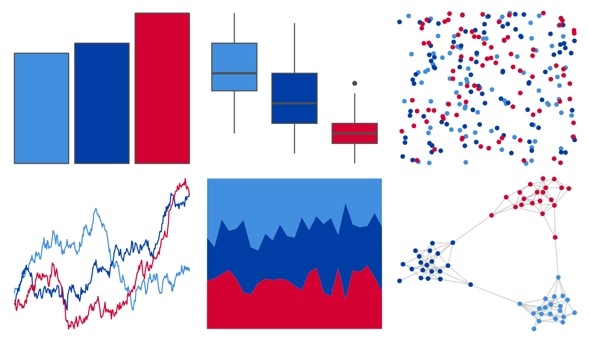

# nbapalettes - clippers_retro 

::: columns
::: {.column width="50%"}

**Github**

[murrayjw/nbapalettes](https://github.com/murrayjw/nbapalettes)
:::

::: {.column width="50%"}

**CRAN**

[nbapalettes](https://CRAN.R-project.org/package=nbapalettes)
:::
:::

<hr> 

Use with [paletteer](https://emilhvitfeldt.github.io/paletteer/) package:

```r
library(paletteer)
paletteer_d("nbapalettes::clippers_retro")
```

Use raw:

```r
c("#418FDEFF", "#003DA5FF", "#D50032FF")
``` 

 

<br>

# Related Palettes

<div class="list" style="display: grid; grid-template-columns: auto auto auto;"> <figure class="figure">
<a href="../../amerika/Dem_Ind_Rep3/"> </a>
</figure> <figure class="figure">
<a href="../../nbapalettes/rockets_city/"> </a>
</figure> <figure class="figure">
<a href="../../nbapalettes/hawks_retro/"> </a>
</figure> <figure class="figure">
<a href="../../trekcolors/starfleet/"> </a>
</figure> <figure class="figure">
<a href="../../nbapalettes/suns_retro/"> </a>
</figure> <figure class="figure">
<a href="../../amerika/Democrat/"> </a>
</figure> <figure class="figure">
<a href="../../nbapalettes/cavaliers_retro/"> </a>
</figure> <figure class="figure">
<a href="../../nbapalettes/cavaliers_90s/"> </a>
</figure> <figure class="figure">
<a href="../../nbapalettes/sixers_retro/"> </a>
</figure> <figure class="figure">
<a href="../../ggthemes/wsj_dem_rep/"> </a>
</figure> <figure class="figure">
<a href="../../ltc/trio1/"> </a>
</figure> <figure class="figure">
<a href="../../nbapalettes/knicks_retro/"> </a>
</figure> 
</div>
