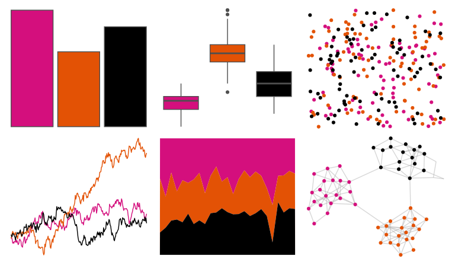

# nbapalettes - heat_0506 

::: columns
::: {.column width="50%"}

**Github**

[murrayjw/nbapalettes](https://github.com/murrayjw/nbapalettes)
:::

::: {.column width="50%"}

**CRAN**

[nbapalettes](https://CRAN.R-project.org/package=nbapalettes)
:::
:::

<hr> 

Use with [paletteer](https://emilhvitfeldt.github.io/paletteer/) package:

```r
library(paletteer)
paletteer_d("nbapalettes::heat_0506")
```

Use raw:

```r
c("#D40F7DFF", "#E35205FF", "#000000FF")
``` 

 

<br>

# Related Palettes

<div class="list" style="display: grid; grid-template-columns: auto auto auto;"> <figure class="figure">
<a href="../../awtools/a_palette/"> </a>
</figure> <figure class="figure">
<a href="../../nbapalettes/bulls/"> </a>
</figure> <figure class="figure">
<a href="../../nbapalettes/heat/"> </a>
</figure> <figure class="figure">
<a href="../../nbapalettes/knicks_retro/"> </a>
</figure> <figure class="figure">
<a href="../../nbapalettes/mavericks_retro/"> </a>
</figure> <figure class="figure">
<a href="../../nbapalettes/cavaliers_90s/"> </a>
</figure> <figure class="figure">
<a href="../../trekcolors/starfleet2/"> </a>
</figure> <figure class="figure">
<a href="../../nbapalettes/raptors_statement/"> </a>
</figure> <figure class="figure">
<a href="../../nbapalettes/cavaliers/"> </a>
</figure> <figure class="figure">
<a href="../../nbapalettes/cavaliers_retro/"> </a>
</figure> <figure class="figure">
<a href="../../fishualize/Centropyge_loricula/"> </a>
</figure> <figure class="figure">
<a href="../../nbapalettes/blazers_statement/"> </a>
</figure> 
</div>
