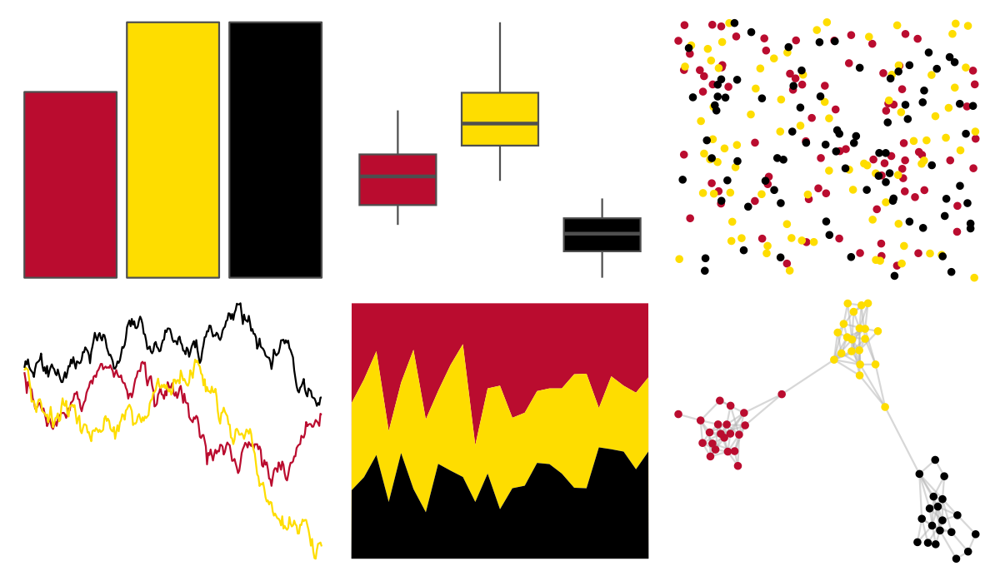

# nbapalettes - heat_90s 

::: columns
::: {.column width="50%"}

**Github**

[murrayjw/nbapalettes](https://github.com/murrayjw/nbapalettes)
:::

::: {.column width="50%"}

**CRAN**

[nbapalettes](https://CRAN.R-project.org/package=nbapalettes)
:::
:::

<hr> 

Use with [paletteer](https://emilhvitfeldt.github.io/paletteer/) package:

```r
library(paletteer)
paletteer_d("nbapalettes::heat_90s")
```

Use raw:

```r
c("#BA0C2FFF", "#FEDD00FF", "#000000FF")
``` 

 

<br>

# Related Palettes

<div class="list" style="display: grid; grid-template-columns: auto auto auto;"> <figure class="figure">
<a href="../../amerika/Dem_Ind_Rep3/"> </a>
</figure> <figure class="figure">
<a href="../../nbapalettes/hawks_90s/"> </a>
</figure> <figure class="figure">
<a href="../../nbapalettes/heat/"> </a>
</figure> <figure class="figure">
<a href="../../nbapalettes/hawks/"> </a>
</figure> <figure class="figure">
<a href="../../nbapalettes/cavaliers/"> </a>
</figure> <figure class="figure">
<a href="../../nbapalettes/rockets_original/"> </a>
</figure> <figure class="figure">
<a href="../../tvthemes/Lannister/"> </a>
</figure> <figure class="figure">
<a href="../../nbapalettes/bucks/"> </a>
</figure> <figure class="figure">
<a href="../../nbapalettes/hawks_statement/"> </a>
</figure> <figure class="figure">
<a href="../../fishualize/Centropyge_loricula/"> </a>
</figure> <figure class="figure">
<a href="../../nbapalettes/supersonics_holiday/"> </a>
</figure> <figure class="figure">
<a href="../../nbapalettes/blazers/"> </a>
</figure> 
</div>
