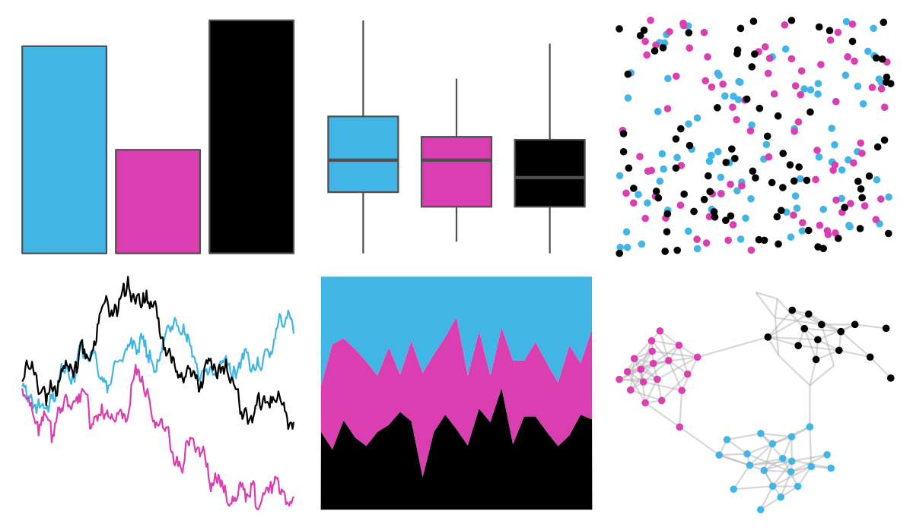

# nbapalettes - heat_vice 

::: columns
::: {.column width="50%"}

**Github**

[murrayjw/nbapalettes](https://github.com/murrayjw/nbapalettes)
:::

::: {.column width="50%"}

**CRAN**

[nbapalettes](https://CRAN.R-project.org/package=nbapalettes)
:::
:::

<hr> 

Use with [paletteer](https://emilhvitfeldt.github.io/paletteer/) package:

```r
library(paletteer)
paletteer_d("nbapalettes::heat_vice")
```

Use raw:

```r
c("#41B6E6FF", "#DB3EB1FF", "#000000FF")
``` 

 

<br>

# Related Palettes

<div class="list" style="display: grid; grid-template-columns: auto auto auto;"> <figure class="figure">
<a href="../../amerika/Dem_Ind_Rep3/"> </a>
</figure> <figure class="figure">
<a href="../../nbapalettes/clippers/"> </a>
</figure> <figure class="figure">
<a href="../../nbapalettes/blazers/"> </a>
</figure> <figure class="figure">
<a href="../../nbapalettes/bulls_city2/"> </a>
</figure> <figure class="figure">
<a href="../../nbapalettes/magic/"> </a>
</figure> <figure class="figure">
<a href="../../feathers/cassowary/"> </a>
</figure> <figure class="figure">
<a href="../../nbapalettes/wizards_city/"> </a>
</figure> <figure class="figure">
<a href="../../nbapalettes/hawks_retro/"> </a>
</figure> <figure class="figure">
<a href="../../nbapalettes/jazz_classic/"> </a>
</figure> <figure class="figure">
<a href="../../nbapalettes/jazz_retro/"> </a>
</figure> <figure class="figure">
<a href="../../tvthemes/Amethyst/"> </a>
</figure> <figure class="figure">
<a href="../../nbapalettes/heat_0506/"> </a>
</figure> 
</div>
