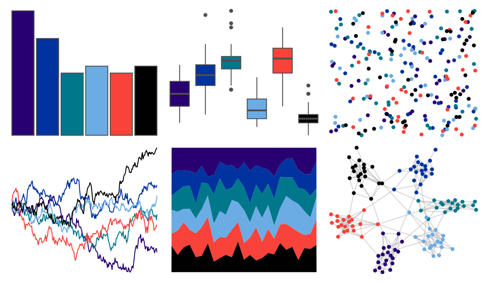

# nbapalettes - hornets_classic 

::: columns
::: {.column width="50%"}

**Github**

[murrayjw/nbapalettes](https://github.com/murrayjw/nbapalettes)
:::

::: {.column width="50%"}

**CRAN**

[nbapalettes](https://CRAN.R-project.org/package=nbapalettes)
:::
:::

<hr> 

Use with [paletteer](https://emilhvitfeldt.github.io/paletteer/) package:

```r
library(paletteer)
paletteer_d("nbapalettes::hornets_classic")
```

Use raw:

```r
c("#280071FF", "#0032A0FF", "#00778BFF", "#6CACE4FF", "#F9423AFF", "#010101FF")
``` 

 

<br>

# Related Palettes

<div class="list" style="display: grid; grid-template-columns: auto auto auto;"> <figure class="figure">
<a href="../../amerika/Dem_Ind_Rep3/"> </a>
</figure> <figure class="figure">
<a href="../../nbapalettes/sixers/"> </a>
</figure> <figure class="figure">
<a href="../../nbapalettes/jazz_classic/"> </a>
</figure> <figure class="figure">
<a href="../../beyonce/X37/"> </a>
</figure> <figure class="figure">
<a href="../../nbapalettes/jazz_retro/"> </a>
</figure> <figure class="figure">
<a href="../../beyonce/X25/"> </a>
</figure> <figure class="figure">
<a href="../../nbapalettes/kings_alt/"> </a>
</figure> <figure class="figure">
<a href="../../MetBrewer/Moreau/"> </a>
</figure> <figure class="figure">
<a href="../../poisonfrogs/Opbluejeans/"> </a>
</figure> <figure class="figure">
<a href="../../nbapalettes/clippers_city/"> </a>
</figure> <figure class="figure">
<a href="../../ggsci/default_aaas/"> </a>
</figure> <figure class="figure">
<a href="../../nbapalettes/bobcats_original/"> </a>
</figure> 
</div>
