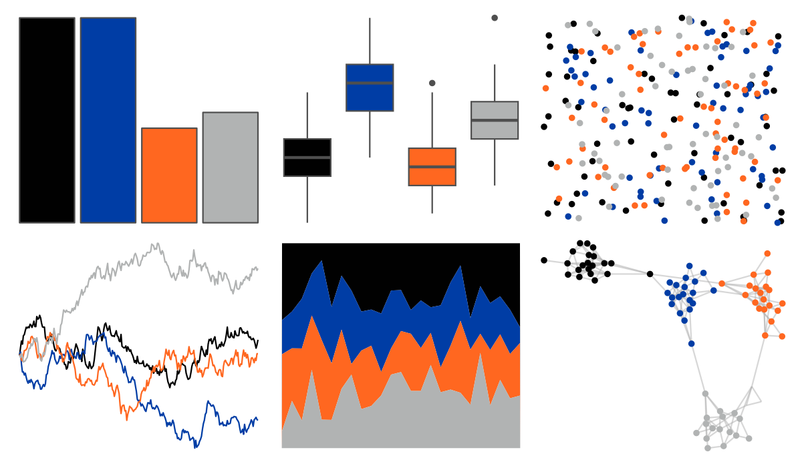

# nbapalettes - knicks_city 

::: columns
::: {.column width="50%"}

**Github**

[murrayjw/nbapalettes](https://github.com/murrayjw/nbapalettes)
:::

::: {.column width="50%"}

**CRAN**

[nbapalettes](https://CRAN.R-project.org/package=nbapalettes)
:::
:::

<hr> 

Use with [paletteer](https://emilhvitfeldt.github.io/paletteer/) package:

```r
library(paletteer)
paletteer_d("nbapalettes::knicks_city")
```

Use raw:

```r
c("#010101FF", "#003DA5FF", "#FF6720FF", "#B1B3B3FF")
``` 

 

<br>

# Related Palettes

<div class="list" style="display: grid; grid-template-columns: auto auto auto;"> <figure class="figure">
<a href="../../awtools/a_palette/"> </a>
</figure> <figure class="figure">
<a href="../../ButterflyColors/hamadryas_feronia/"> </a>
</figure> <figure class="figure">
<a href="../../ButterflyColors/hamadryas_feronia/"> </a>
</figure> <figure class="figure">
<a href="../../nbapalettes/suns_statement/"> </a>
</figure> <figure class="figure">
<a href="../../fishualize/Pseudochromis_aldabraensis/"> </a>
</figure> <figure class="figure">
<a href="../../rockthemes/heep/"> </a>
</figure> <figure class="figure">
<a href="../../nbapalettes/knicks_city2/"> </a>
</figure> <figure class="figure">
<a href="../../fishualize/Serranus_scriba/"> </a>
</figure> <figure class="figure">
<a href="../../nbapalettes/nets_city/"> </a>
</figure> <figure class="figure">
<a href="../../ltc/alger/"> </a>
</figure> <figure class="figure">
<a href="../../PrettyCols/Lively/"> </a>
</figure> <figure class="figure">
<a href="../../rockthemes/miles/"> </a>
</figure> 
</div>
