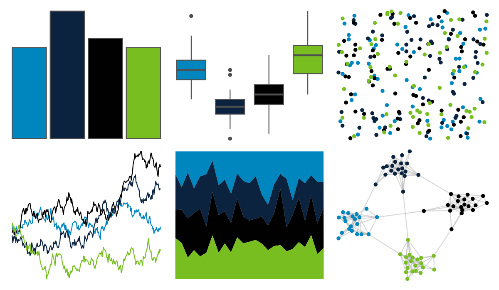

# nbapalettes - mavericks_city 

::: columns
::: {.column width="50%"}

**Github**

[murrayjw/nbapalettes](https://github.com/murrayjw/nbapalettes)
:::

::: {.column width="50%"}

**CRAN**

[nbapalettes](https://CRAN.R-project.org/package=nbapalettes)
:::
:::

<hr> 

Use with [paletteer](https://emilhvitfeldt.github.io/paletteer/) package:

```r
library(paletteer)
paletteer_d("nbapalettes::mavericks_city")
```

Use raw:

```r
c("#0086BFFF", "#0C2340FF", "#010101FF", "#78BE21FF")
``` 

 

<br>

# Related Palettes

<div class="list" style="display: grid; grid-template-columns: auto auto auto;"> <figure class="figure">
<a href="../../awtools/a_palette/"> </a>
</figure> <figure class="figure">
<a href="../../trekcolors/romulan/"> </a>
</figure> <figure class="figure">
<a href="../../ochRe/nolan_ned/"> </a>
</figure> <figure class="figure">
<a href="../../Manu/Gloomy_Nudi/"> </a>
</figure> <figure class="figure">
<a href="../../nbapalettes/bucks_city/"> </a>
</figure> <figure class="figure">
<a href="../../rtist/hopper/"> </a>
</figure> <figure class="figure">
<a href="../../peRReo/eminem/"> </a>
</figure> <figure class="figure">
<a href="../../ggthemes/wsj_black_green/"> </a>
</figure> <figure class="figure">
<a href="../../ggprism/starry/"> </a>
</figure> <figure class="figure">
<a href="../../rtist/davinci/"> </a>
</figure> <figure class="figure">
<a href="../../nbapalettes/lakers_city/"> </a>
</figure> <figure class="figure">
<a href="../../nbapalettes/pacers_venue/"> </a>
</figure> 
</div>
