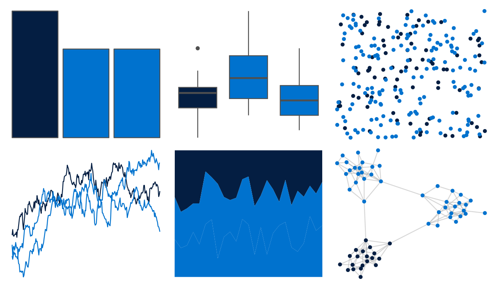

# nbapalettes - thunder_statement 

::: columns
::: {.column width="50%"}

**Github**

[murrayjw/nbapalettes](https://github.com/murrayjw/nbapalettes)
:::

::: {.column width="50%"}

**CRAN**

[nbapalettes](https://CRAN.R-project.org/package=nbapalettes)
:::
:::

<hr> 

Use with [paletteer](https://emilhvitfeldt.github.io/paletteer/) package:

```r
library(paletteer)
paletteer_d("nbapalettes::thunder_statement")
```

Use raw:

```r
c("#041E42FF", "#0072CEFF", "#0072CEFF")
``` 

 

<br>

# Related Palettes

<div class="list" style="display: grid; grid-template-columns: auto auto auto;"> <figure class="figure">
<a href="../../amerika/Dem_Ind_Rep3/"> </a>
</figure> <figure class="figure">
<a href="../../amerika/Democrat/"> </a>
</figure> <figure class="figure">
<a href="../../nbapalettes/clippers_retro/"> </a>
</figure> <figure class="figure">
<a href="../../poisonfrogs/Dtazureus/"> </a>
</figure> <figure class="figure">
<a href="../../palettesForR/Cool/"> </a>
</figure> <figure class="figure">
<a href="../../nbapalettes/rockets_city/"> </a>
</figure> <figure class="figure">
<a href="../../PrettyCols/Velvet/"> </a>
</figure> <figure class="figure">
<a href="../../nbapalettes/kings_alt2/"> </a>
</figure> <figure class="figure">
<a href="../../nbapalettes/kings/"> </a>
</figure> <figure class="figure">
<a href="../../ggprism/winter_bright/"> </a>
</figure> <figure class="figure">
<a href="../../beyonce/X31/"> </a>
</figure> <figure class="figure">
<a href="../../beyonce/X13/"> </a>
</figure> 
</div>
