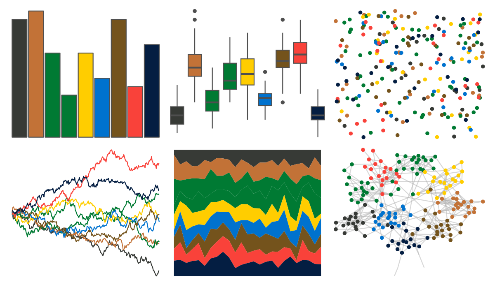

# nbapalettes - thunder_tribute 

::: columns
::: {.column width="50%"}

**Github**

[murrayjw/nbapalettes](https://github.com/murrayjw/nbapalettes)
:::

::: {.column width="50%"}

**CRAN**

[nbapalettes](https://CRAN.R-project.org/package=nbapalettes)
:::
:::

<hr> 

Use with [paletteer](https://emilhvitfeldt.github.io/paletteer/) package:

```r
library(paletteer)
paletteer_d("nbapalettes::thunder_tribute")
```

Use raw:

```r
c("#373A36FF", "#C27237FF", "#007A33FF", "#007A33FF", "#FFCD00FF", "#0072CEFF", "#74531CFF", "#F9423AFF", "#041E42FF")
``` 

 

<br>

# Related Palettes

<div class="list" style="display: grid; grid-template-columns: auto auto auto;"> <figure class="figure">
<a href="../../amerika/Dem_Ind_Rep3/"> </a>
</figure> <figure class="figure">
<a href="../../MexBrewer/Huida/"> </a>
</figure> <figure class="figure">
<a href="../../ggsci/default_uchicago/"> </a>
</figure> <figure class="figure">
<a href="../../tvthemes/simpsons/"> </a>
</figure> <figure class="figure">
<a href="../../ltc/hat/"> </a>
</figure> <figure class="figure">
<a href="../../ltc/ten_colors/"> </a>
</figure> <figure class="figure">
<a href="../../beyonce/X88/"> </a>
</figure> <figure class="figure">
<a href="../../peRReo/badbunny2/"> </a>
</figure> <figure class="figure">
<a href="../../ggsci/default_jco/"> </a>
</figure> <figure class="figure">
<a href="../../palettetown/makuhita/"> </a>
</figure> <figure class="figure">
<a href="../../wesanderson/BottleRocket2/"> </a>
</figure> <figure class="figure">
<a href="../../jcolors/pal7/"> </a>
</figure> 
</div>
