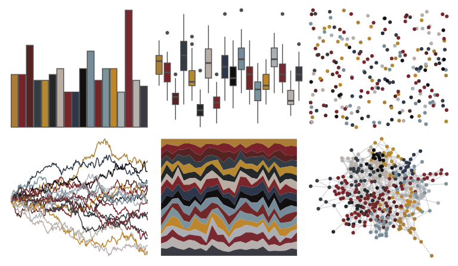
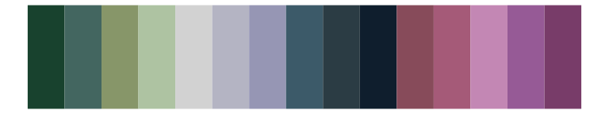
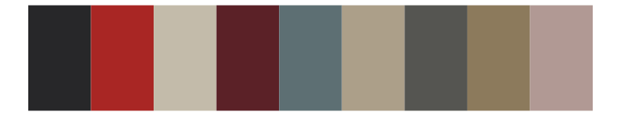
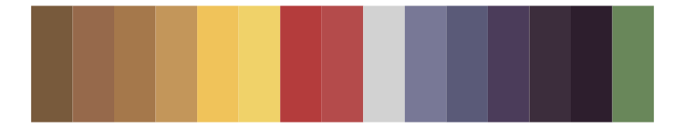

# ochRe - emu_woman_paired 

::: columns
::: {.column width="50%"}

**Github**

[hollylkirk/ochRe](https://github.com/hollylkirk/ochRe)
:::

::: {.column width="50%"}

**CRAN**

Not on CRAN
:::
:::

<hr> 

Use with [paletteer](https://emilhvitfeldt.github.io/paletteer/) package:

```r
library(paletteer)
paletteer_d("ochRe::emu_woman_paired")
```

Use raw:

```r
c("#AB7E37FF", "#79222AFF", "#562323FF", "#333B43FF", "#B68830FF", "#232728FF", "#B9ACA3FF", "#7A2529FF", "#2C374AFF", "#120F11FF", "#768B99FF", "#6F2827FF", "#7B939CFF", "#BD852CFF", "#AAAEB5FF", "#78292FFF", "#B6B0AEFF", "#3A3A43FF")
``` 

 

<br>

# Related Palettes

<div class="list" style="display: grid; grid-template-columns: auto auto auto;"> <figure class="figure">
<a href="../../awtools/a_palette/"> </a>
</figure> <figure class="figure">
<a href="../../impressionist.colors/te_aa_no_areois/"> </a>
</figure> <figure class="figure">
<a href="../../impressionist.colors/les_peupliers/"> </a>
</figure> <figure class="figure">
<a href="../../impressionist.colors/les_nympheas_2/"> </a>
</figure> <figure class="figure">
<a href="../../beyonce/X61/"> </a>
</figure> <figure class="figure">
<a href="../../impressionist.colors/la_yole/"> </a>
</figure> <figure class="figure">
<a href="../../impressionist.colors/fleurs_dans_un_vase_de_cristal/"> </a>
</figure> <figure class="figure">
<a href="../../peRReo/wyy/"> </a>
</figure> <figure class="figure">
<a href="../../impressionist.colors/la_chanson_du_chien/"> </a>
</figure> <figure class="figure">
<a href="../../MetBrewer/Redon/"> </a>
</figure> <figure class="figure">
<a href="../../impressionist.colors/un_dimanche_apres_midi_a_l_ile_de_la_grande_jatte/"> </a>
</figure> <figure class="figure">
<a href="../../impressionist.colors/vahine_no_te_tiare/"> </a>
</figure> 
</div>
