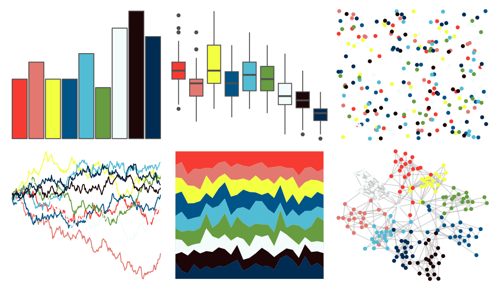

# ochRe - healthy_reef 

::: columns
::: {.column width="50%"}

**Github**

[hollylkirk/ochRe](https://github.com/hollylkirk/ochRe)
:::

::: {.column width="50%"}

**CRAN**

Not on CRAN
:::
:::

<hr> 

Use with [paletteer](https://emilhvitfeldt.github.io/paletteer/) package:

```r
library(paletteer)
paletteer_d("ochRe::healthy_reef")
```

Use raw:

```r
c("#F63B32FF", "#E37870FF", "#F3FF41FF", "#005487FF", "#52BCD4FF", "#679C40FF", "#F3FBFBFF", "#1C0608FF", "#002B52FF")
``` 

 

<br>

# Related Palettes

<div class="list" style="display: grid; grid-template-columns: auto auto auto;"> <figure class="figure">
<a href="../../awtools/a_palette/"> </a>
</figure> <figure class="figure">
<a href="../../ggthemr/sea/"> </a>
</figure> <figure class="figure">
<a href="../../tvthemes/Regular/"> </a>
</figure> <figure class="figure">
<a href="../../ggthemes/calc/"> </a>
</figure> <figure class="figure">
<a href="../../tvthemes/spongeBob/"> </a>
</figure> <figure class="figure">
<a href="../../werpals/benagil/"> </a>
</figure> <figure class="figure">
<a href="../../werpals/okavango/"> </a>
</figure> <figure class="figure">
<a href="../../tvthemes/kimPossible/"> </a>
</figure> <figure class="figure">
<a href="../../trekcolors/gorn/"> </a>
</figure> <figure class="figure">
<a href="../../palettetown/minun/"> </a>
</figure> <figure class="figure">
<a href="../../colorblindr/OkabeIto_black/"> </a>
</figure> <figure class="figure">
<a href="../../tidyquant/tq_green/"> </a>
</figure> 
</div>
