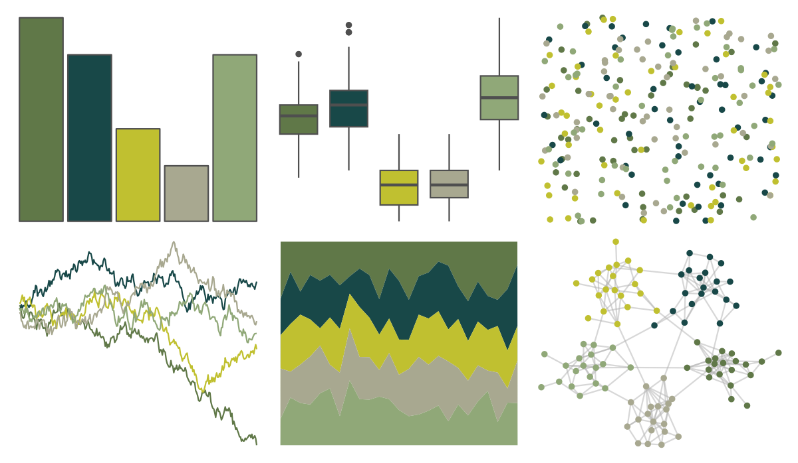

# ochRe - jumping_frog 

::: columns
::: {.column width="50%"}

**Github**

[hollylkirk/ochRe](https://github.com/hollylkirk/ochRe)
:::

::: {.column width="50%"}

**CRAN**

Not on CRAN
:::
:::

<hr> 

Use with [paletteer](https://emilhvitfeldt.github.io/paletteer/) package:

```r
library(paletteer)
paletteer_d("ochRe::jumping_frog")
```

Use raw:

```r
c("#607848FF", "#184848FF", "#C0C030FF", "#A8A890FF", "#90A878FF")
``` 

 

<br>

# Related Palettes

<div class="list" style="display: grid; grid-template-columns: auto auto auto;"> <figure class="figure">
<a href="../../awtools/a_palette/"> </a>
</figure> <figure class="figure">
<a href="../../ButterflyColors/hamadryas_feronia/"> </a>
</figure> <figure class="figure">
<a href="../../ButterflyColors/hamadryas_feronia/"> </a>
</figure> <figure class="figure">
<a href="../../colRoz/r_aculeatus/"> </a>
</figure> <figure class="figure">
<a href="../../ghibli/MarnieMedium2/"> </a>
</figure> <figure class="figure">
<a href="../../calecopal/agriculture/"> </a>
</figure> <figure class="figure">
<a href="../../lisa/WassilyKandinsky/"> </a>
</figure> <figure class="figure">
<a href="../../Redmonder/sPBIYlGn/"> </a>
</figure> <figure class="figure">
<a href="../../calecopal/bigsur2/"> </a>
</figure> <figure class="figure">
<a href="../../lisa/JohnSingerSargent_1/"> </a>
</figure> <figure class="figure">
<a href="../../fishualize/Oncorhynchus_keta/"> </a>
</figure> <figure class="figure">
<a href="../../werpals/monet/"> </a>
</figure> 
</div>
