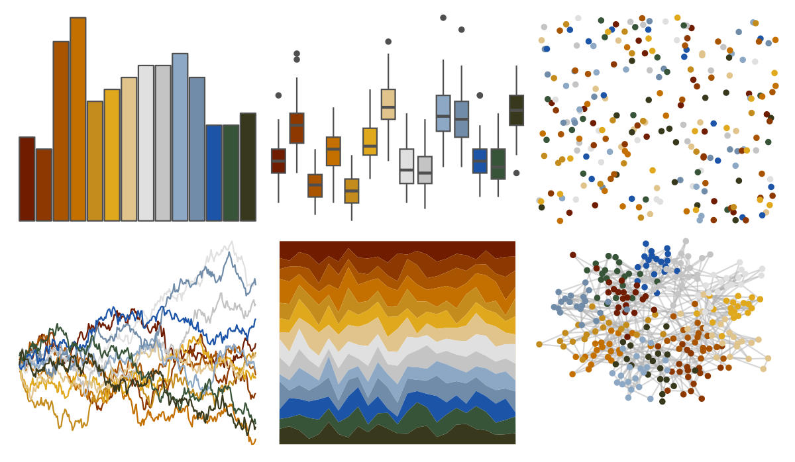

# ochRe - olsen_seq 

::: columns
::: {.column width="50%"}

**Github**

[hollylkirk/ochRe](https://github.com/hollylkirk/ochRe)
:::

::: {.column width="50%"}

**CRAN**

Not on CRAN
:::
:::

<hr> 

Use with [paletteer](https://emilhvitfeldt.github.io/paletteer/) package:

```r
library(paletteer)
paletteer_d("ochRe::olsen_seq")
```

Use raw:

```r
c("#701C00FF", "#8C3800FF", "#A85400FF", "#C47000FF", "#C48C1CFF", "#E0A81CFF", "#E0C48CFF", "#E0E0E0FF", "#C4C4C4FF", "#8CA8C4FF", "#708CA8FF", "#1C54A8FF", "#385438FF", "#38381CFF")
``` 

 

<br>

# Related Palettes

<div class="list" style="display: grid; grid-template-columns: auto auto auto;"> <figure class="figure">
<a href="../../awtools/a_palette/"> </a>
</figure> <figure class="figure">
<a href="../../ButterflyColors/hamadryas_feronia/"> </a>
</figure> <figure class="figure">
<a href="../../ButterflyColors/hamadryas_feronia/"> </a>
</figure> <figure class="figure">
<a href="../../palettetown/gloom/"> </a>
</figure> <figure class="figure">
<a href="../../dutchmasters/milkmaid/"> </a>
</figure> <figure class="figure">
<a href="../../impressionist.colors/vahine_no_te_tiare/"> </a>
</figure> <figure class="figure">
<a href="../../palettetown/cyndaquil/"> </a>
</figure> <figure class="figure">
<a href="../../palettetown/quilava/"> </a>
</figure> <figure class="figure">
<a href="../../palettetown/miltank/"> </a>
</figure> <figure class="figure">
<a href="../../miscpalettes/brightPastel/"> </a>
</figure> <figure class="figure">
<a href="../../palettetown/lapras/"> </a>
</figure> <figure class="figure">
<a href="../../palettetown/hariyama/"> </a>
</figure> 
</div>
