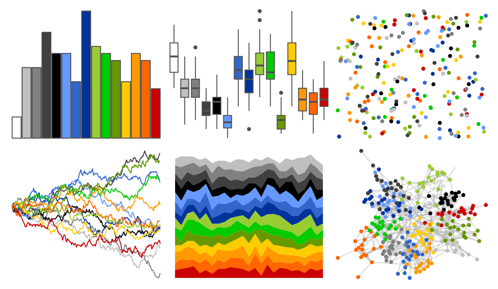

# palettesForR - Android 

::: columns
::: {.column width="50%"}

**Github**

[frareb/palettesForR](https://github.com/frareb/palettesForR)
:::

::: {.column width="50%"}

**CRAN**

[palettesForR](https://CRAN.R-project.org/package=palettesForR)
:::
:::

<hr> 

Use with [paletteer](https://emilhvitfeldt.github.io/paletteer/) package:

```r
library(paletteer)
paletteer_d("palettesForR::Android")
```

Use raw:

```r
c("#FFFFFFFF", "#BFBFBFFF", "#808080FF", "#404040FF", "#000000FF", "#6699FFFF", "#3366CCFF", "#003399FF", "#99CC33FF", "#00CC00FF", "#669900FF", "#FFCC00FF", "#FF9900FF", "#FF6600FF", "#CC0000FF")
``` 

 

<br>

# Related Palettes

<div class="list" style="display: grid; grid-template-columns: auto auto auto;"> <figure class="figure">
<a href="../../awtools/a_palette/"> </a>
</figure> <figure class="figure">
<a href="../../palettetown/typhlosion/"> </a>
</figure> <figure class="figure">
<a href="../../palettetown/grovyle/"> </a>
</figure> <figure class="figure">
<a href="../../palettetown/crawdaunt/"> </a>
</figure> <figure class="figure">
<a href="../../palettetown/ledian/"> </a>
</figure> <figure class="figure">
<a href="../../palettetown/quilava/"> </a>
</figure> <figure class="figure">
<a href="../../palettetown/cyndaquil/"> </a>
</figure> <figure class="figure">
<a href="../../palettetown/gyarados/"> </a>
</figure> <figure class="figure">
<a href="../../palettetown/shiftry/"> </a>
</figure> <figure class="figure">
<a href="../../palettetown/mareep/"> </a>
</figure> <figure class="figure">
<a href="../../ggthemr/copper/"> </a>
</figure> <figure class="figure">
<a href="../../palettetown/manectric/"> </a>
</figure> 
</div>
