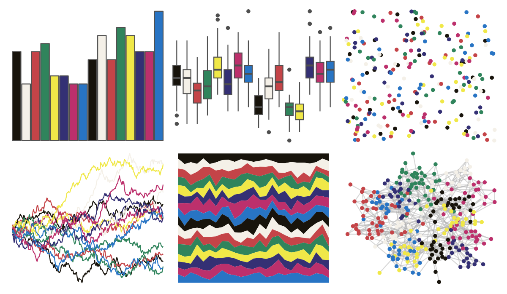

# palettesForR - Paintjet 

::: columns
::: {.column width="50%"}

**Github**

[frareb/palettesForR](https://github.com/frareb/palettesForR)
:::

::: {.column width="50%"}

**CRAN**

[palettesForR](https://CRAN.R-project.org/package=palettesForR)
:::
:::

<hr> 

Use with [paletteer](https://emilhvitfeldt.github.io/paletteer/) package:

```r
library(paletteer)
paletteer_d("palettesForR::Paintjet")
```

Use raw:

```r
c("#18140CFF", "#F4F0E8FF", "#C44448FF", "#30845CFF", "#F0E848FF", "#343074FF", "#BC306CFF", "#2874C4FF", "#18140CFF", "#F4F0E8FF", "#C44448FF", "#30845CFF", "#F0E848FF", "#343074FF", "#BC306CFF", "#2874C4FF")
``` 

 

<br>

# Related Palettes

<div class="list" style="display: grid; grid-template-columns: auto auto auto;"> <figure class="figure">
<a href="../../awtools/a_palette/"> </a>
</figure> <figure class="figure">
<a href="../../palettetown/manectric/"> </a>
</figure> <figure class="figure">
<a href="../../palettetown/taillow/"> </a>
</figure> <figure class="figure">
<a href="../../palettetown/minun/"> </a>
</figure> <figure class="figure">
<a href="../../jcolors/pal8/"> </a>
</figure> <figure class="figure">
<a href="../../palettetown/seviper/"> </a>
</figure> <figure class="figure">
<a href="../../palettetown/volbeat/"> </a>
</figure> <figure class="figure">
<a href="../../pals/tol/"> </a>
</figure> <figure class="figure">
<a href="../../palettetown/chimecho/"> </a>
</figure> <figure class="figure">
<a href="../../palettetown/loudred/"> </a>
</figure> <figure class="figure">
<a href="../../palettetown/exploud/"> </a>
</figure> <figure class="figure">
<a href="../../palettetown/roselia/"> </a>
</figure> 
</div>
