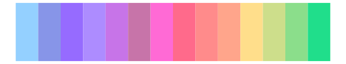
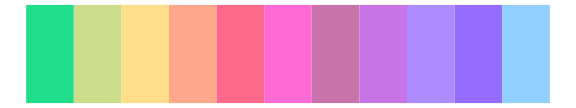
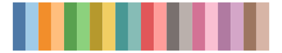

# palettesForR - Pastels 

::: columns
::: {.column width="50%"}

**Github**

[frareb/palettesForR](https://github.com/frareb/palettesForR)
:::

::: {.column width="50%"}

**CRAN**

[palettesForR](https://CRAN.R-project.org/package=palettesForR)
:::
:::

<hr> 

Use with [paletteer](https://emilhvitfeldt.github.io/paletteer/) package:

```r
library(paletteer)
paletteer_d("palettesForR::Pastels")
```

Use raw:

```r
c("#E29191FF", "#99DD92FF", "#93D8B9FF", "#94C4D3FF", "#949ACEFF", "#B394CCFF", "#CC96B1FF", "#CCA499FF", "#DFE592FF", "#FFA560FF", "#6BFF63FF", "#65FFCCFF", "#65C4FFFF", "#656BFFFF", "#AD65FFFF", "#FF65F4FF", "#FF6584FF", "#FF6565FF")
``` 

 

<br>

# Related Palettes

<div class="list" style="display: grid; grid-template-columns: auto auto auto;"> <figure class="figure">
<a href="../../awtools/a_palette/"> </a>
</figure> <figure class="figure">
<a href="../../miscpalettes/pastel/"> </a>
</figure> <figure class="figure">
<a href="../../vapeplot/vaporwave/"> </a>
</figure> <figure class="figure">
<a href="../../ggthemes/Classic_20/"> </a>
</figure> <figure class="figure">
<a href="../../ggsci/category20_d3/"> </a>
</figure> <figure class="figure">
<a href="../../vapoRwave/vapoRwave/"> </a>
</figure> <figure class="figure">
<a href="../../ggthemes/Hue_Circle/"> </a>
</figure> <figure class="figure">
<a href="../../ggthemes/Tableau_20/"> </a>
</figure> <figure class="figure">
<a href="../../tidyquant/tq_dark/"> </a>
</figure> <figure class="figure">
<a href="../../trekcolors/lcars_alt/"> </a>
</figure> <figure class="figure">
<a href="../../rcartocolor/Vivid/"> </a>
</figure> <figure class="figure">
<a href="../../ggthemes/Classic_Cyclic/"> </a>
</figure> 
</div>
