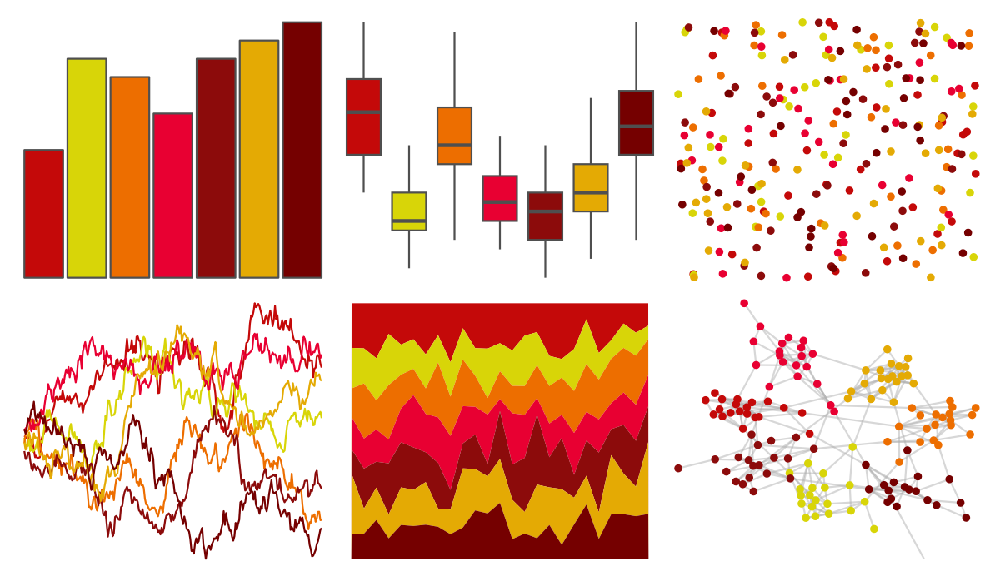

# palettesForR - Warm 

::: columns
::: {.column width="50%"}

**Github**

[frareb/palettesForR](https://github.com/frareb/palettesForR)
:::

::: {.column width="50%"}

**CRAN**

[palettesForR](https://CRAN.R-project.org/package=palettesForR)
:::
:::

<hr> 

Use with [paletteer](https://emilhvitfeldt.github.io/paletteer/) package:

```r
library(paletteer)
paletteer_d("palettesForR::Warm")
```

Use raw:

```r
c("#C40909FF", "#D8D508FF", "#ED6E00FF", "#E80032FF", "#8C0B0BFF", "#E4AA04FF", "#750000FF")
``` 

 

<br>

# Related Palettes

<div class="list" style="display: grid; grid-template-columns: auto auto auto;"> <figure class="figure">
<a href="../../awtools/a_palette/"> </a>
</figure> <figure class="figure">
<a href="../../MetBrewer/Greek/"> </a>
</figure> <figure class="figure">
<a href="../../fishualize/Dermatolepis_inermis/"> </a>
</figure> <figure class="figure">
<a href="../../werpals/halong/"> </a>
</figure> <figure class="figure">
<a href="../../tvthemes/Martell/"> </a>
</figure> <figure class="figure">
<a href="../../nbapalettes/nuggets_city/"> </a>
</figure> <figure class="figure">
<a href="../../NineteenEightyR/seventies_aint_done_yet/"> </a>
</figure> <figure class="figure">
<a href="../../fishualize/Labrisomus_nuchipinnis/"> </a>
</figure> <figure class="figure">
<a href="../../MetBrewer/Peru2/"> </a>
</figure> <figure class="figure">
<a href="../../beyonce/X36/"> </a>
</figure> <figure class="figure">
<a href="../../yarrr/rat/"> </a>
</figure> <figure class="figure">
<a href="../../calecopal/fire/"> </a>
</figure> 
</div>
