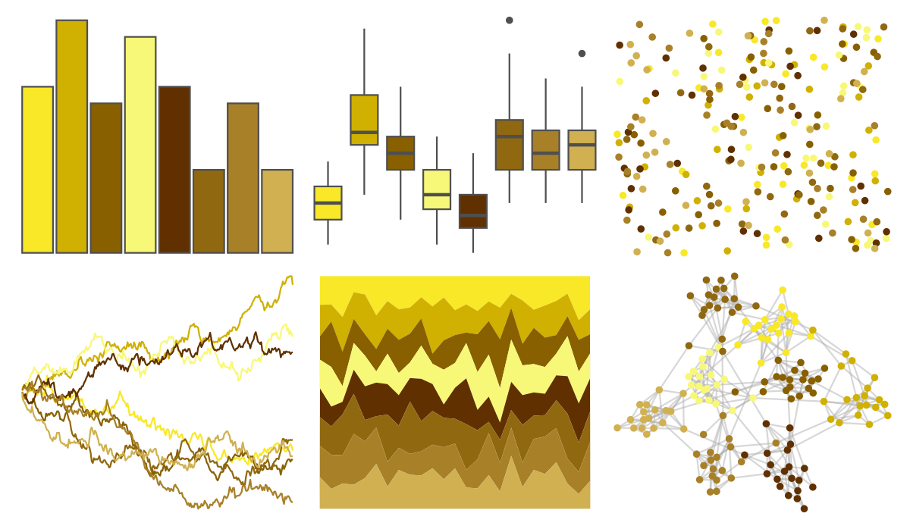

# palettetown - abra 

::: columns
::: {.column width="50%"}

**Github**

[timcdlucas/palettetown](https://github.com/timcdlucas/palettetown)
:::

::: {.column width="50%"}

**CRAN**

[palettetown](https://CRAN.R-project.org/package=palettetown)
:::
:::

<hr> 

Use with [paletteer](https://emilhvitfeldt.github.io/paletteer/) package:

```r
library(paletteer)
paletteer_d("palettetown::abra")
```

Use raw:

```r
c("#F8E828FF", "#D0B000FF", "#886000FF", "#F8F878FF", "#603000FF", "#906810FF", "#A88028FF", "#D0B050FF")
``` 

 

<br>

# Related Palettes

<div class="list" style="display: grid; grid-template-columns: auto auto auto;"> <figure class="figure">
<a href="../../amerika/Dem_Ind_Rep3/"> </a>
</figure> <figure class="figure">
<a href="../../poisonfrogs/Pterribilis/"> </a>
</figure> <figure class="figure">
<a href="../../ggsci/yellow_tw3/"> </a>
</figure> <figure class="figure">
<a href="../../ggsci/yellow_bs5/"> </a>
</figure> <figure class="figure">
<a href="../../colRoz/k_scurra/"> </a>
</figure> <figure class="figure">
<a href="../../beyonce/X59/"> </a>
</figure> <figure class="figure">
<a href="../../fishualize/Antennarius_multiocellatus/"> </a>
</figure> <figure class="figure">
<a href="../../palettetown/sunflora/"> </a>
</figure> <figure class="figure">
<a href="../../palettetown/swinub/"> </a>
</figure> <figure class="figure">
<a href="../../fishualize/Chormis_multilineata/"> </a>
</figure> <figure class="figure">
<a href="../../peRReo/daddy2/"> </a>
</figure> <figure class="figure">
<a href="../../fishualize/Hippocampus_reidi/"> </a>
</figure> 
</div>
