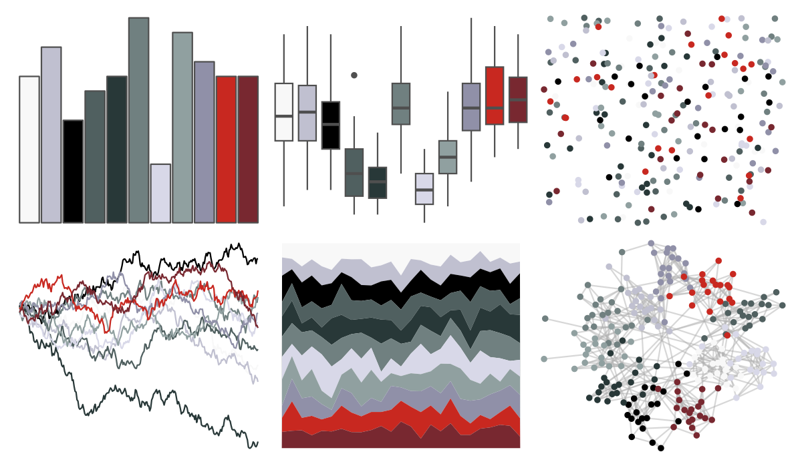
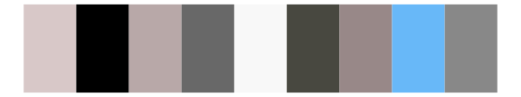
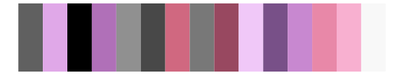

# palettetown - absol 

::: columns
::: {.column width="50%"}

**Github**

[timcdlucas/palettetown](https://github.com/timcdlucas/palettetown)
:::

::: {.column width="50%"}

**CRAN**

[palettetown](https://CRAN.R-project.org/package=palettetown)
:::
:::

<hr> 

Use with [paletteer](https://emilhvitfeldt.github.io/paletteer/) package:

```r
library(paletteer)
paletteer_d("palettetown::absol")
```

Use raw:

```r
c("#F8F8F8FF", "#C0C0D0FF", "#000000FF", "#506060FF", "#283838FF", "#708080FF", "#D8D8E8FF", "#90A0A0FF", "#9090A8FF", "#C82820FF", "#782830FF")
``` 

 

<br>

# Related Palettes

<div class="list" style="display: grid; grid-template-columns: auto auto auto;"> <figure class="figure">
<a href="../../amerika/Dem_Ind_Rep3/"> </a>
</figure> <figure class="figure">
<a href="../../palettetown/meditite/"> </a>
</figure> <figure class="figure">
<a href="../../Redmonder/dPBIRdGy/"> </a>
</figure> <figure class="figure">
<a href="../../palettetown/altaria/"> </a>
</figure> <figure class="figure">
<a href="../../palettetown/lairon/"> </a>
</figure> <figure class="figure">
<a href="../../palettetown/sableye/"> </a>
</figure> <figure class="figure">
<a href="../../palettetown/spoink/"> </a>
</figure> <figure class="figure">
<a href="../../palettetown/aron/"> </a>
</figure> <figure class="figure">
<a href="../../palettetown/zangoose/"> </a>
</figure> <figure class="figure">
<a href="../../palettetown/mightyena/"> </a>
</figure> <figure class="figure">
<a href="../../palettetown/grumpig/"> </a>
</figure> <figure class="figure">
<a href="../../palettetown/aggron/"> </a>
</figure> 
</div>
