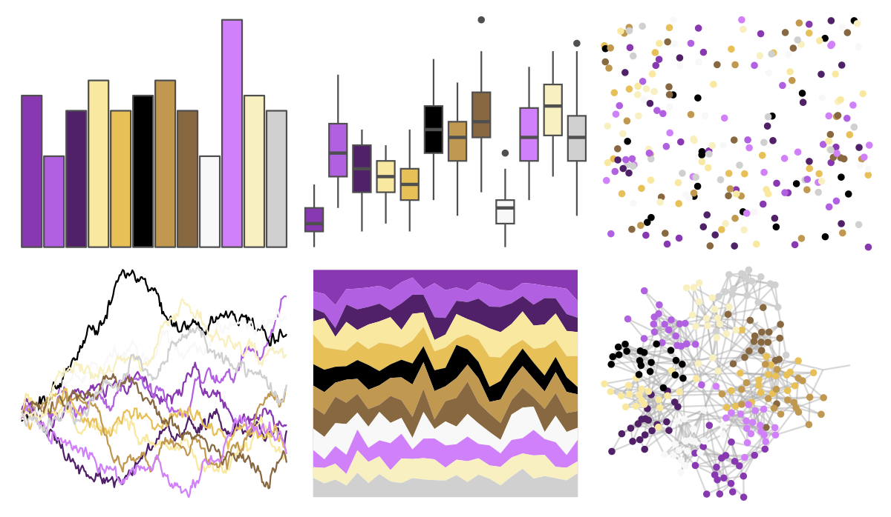
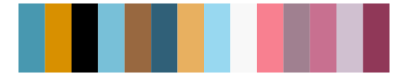

# palettetown - aipom 

::: columns
::: {.column width="50%"}

**Github**

[timcdlucas/palettetown](https://github.com/timcdlucas/palettetown)
:::

::: {.column width="50%"}

**CRAN**

[palettetown](https://CRAN.R-project.org/package=palettetown)
:::
:::

<hr> 

Use with [paletteer](https://emilhvitfeldt.github.io/paletteer/) package:

```r
library(paletteer)
paletteer_d("palettetown::aipom")
```

Use raw:

```r
c("#8838B0FF", "#B060E0FF", "#502068FF", "#F8E8A0FF", "#E8C058FF", "#000000FF", "#C09850FF", "#886840FF", "#F8F8F8FF", "#D080F8FF", "#F8F0C0FF", "#D0D0D0FF")
``` 

 

<br>

# Related Palettes

<div class="list" style="display: grid; grid-template-columns: auto auto auto;"> <figure class="figure">
<a href="../../awtools/a_palette/"> </a>
</figure> <figure class="figure">
<a href="../../ButterflyColors/hamadryas_feronia/"> </a>
</figure> <figure class="figure">
<a href="../../ButterflyColors/hamadryas_feronia/"> </a>
</figure> <figure class="figure">
<a href="../../palettetown/jirachi/"> </a>
</figure> <figure class="figure">
<a href="../../palettetown/jynx/"> </a>
</figure> <figure class="figure">
<a href="../../palettetown/chimecho/"> </a>
</figure> <figure class="figure">
<a href="../../palettetown/illumise/"> </a>
</figure> <figure class="figure">
<a href="../../palettetown/delcatty/"> </a>
</figure> <figure class="figure">
<a href="../../palettetown/miltank/"> </a>
</figure> <figure class="figure">
<a href="../../palettetown/swalot/"> </a>
</figure> <figure class="figure">
<a href="../../palettetown/huntail/"> </a>
</figure> <figure class="figure">
<a href="../../palettetown/pelipper/"> </a>
</figure> 
</div>
