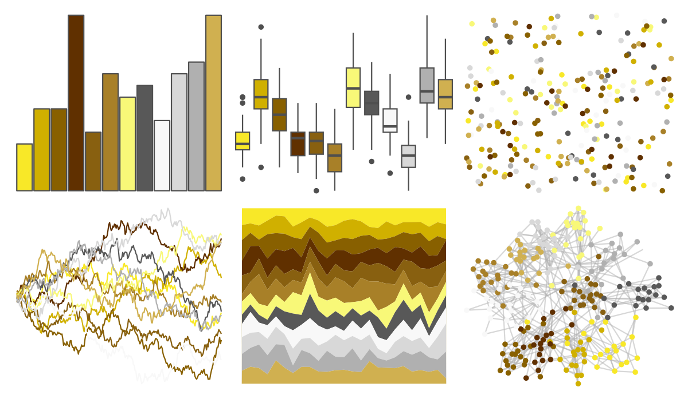

# palettetown - alakazam 

::: columns
::: {.column width="50%"}

**Github**

[timcdlucas/palettetown](https://github.com/timcdlucas/palettetown)
:::

::: {.column width="50%"}

**CRAN**

[palettetown](https://CRAN.R-project.org/package=palettetown)
:::
:::

<hr> 

Use with [paletteer](https://emilhvitfeldt.github.io/paletteer/) package:

```r
library(paletteer)
paletteer_d("palettetown::alakazam")
```

Use raw:

```r
c("#F8E828FF", "#D0B000FF", "#886000FF", "#603000FF", "#886010FF", "#A88028FF", "#F8F878FF", "#585858FF", "#F8F8F8FF", "#D8D8D8FF", "#B0B0B0FF", "#D0B050FF")
``` 

 

<br>

# Related Palettes

<div class="list" style="display: grid; grid-template-columns: auto auto auto;"> <figure class="figure">
<a href="../../awtools/a_palette/"> </a>
</figure> <figure class="figure">
<a href="../../ButterflyColors/hamadryas_feronia/"> </a>
</figure> <figure class="figure">
<a href="../../ButterflyColors/hamadryas_feronia/"> </a>
</figure> <figure class="figure">
<a href="../../palettetown/sandslash/"> </a>
</figure> <figure class="figure">
<a href="../../palettetown/stantler/"> </a>
</figure> <figure class="figure">
<a href="../../palettetown/teddiursa/"> </a>
</figure> <figure class="figure">
<a href="../../palettetown/sandshrew/"> </a>
</figure> <figure class="figure">
<a href="../../palettetown/ursaring/"> </a>
</figure> <figure class="figure">
<a href="../../palettetown/golem/"> </a>
</figure> <figure class="figure">
<a href="../../palettetown/zapdos/"> </a>
</figure> <figure class="figure">
<a href="../../palettetown/exeggutor/"> </a>
</figure> <figure class="figure">
<a href="../../palettetown/hoothoot/"> </a>
</figure> 
</div>
