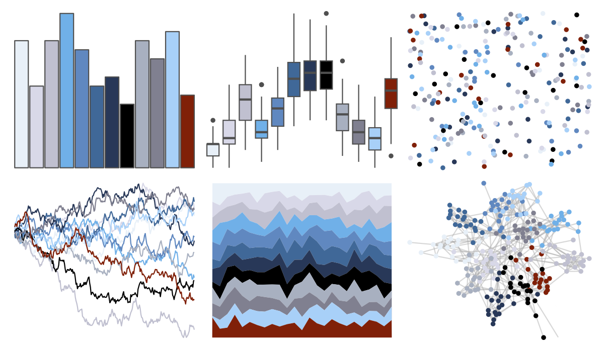

# palettetown - altaria 

::: columns
::: {.column width="50%"}

**Github**

[timcdlucas/palettetown](https://github.com/timcdlucas/palettetown)
:::

::: {.column width="50%"}

**CRAN**

[palettetown](https://CRAN.R-project.org/package=palettetown)
:::
:::

<hr> 

Use with [paletteer](https://emilhvitfeldt.github.io/paletteer/) package:

```r
library(paletteer)
paletteer_d("palettetown::altaria")
```

Use raw:

```r
c("#E8F0F8FF", "#D8D8E8FF", "#C0C0D0FF", "#70B0E8FF", "#6088C0FF", "#406898FF", "#283858FF", "#000000FF", "#A8B0C0FF", "#808090FF", "#A8D0F8FF", "#802008FF")
``` 

 

<br>

# Related Palettes

<div class="list" style="display: grid; grid-template-columns: auto auto auto;"> <figure class="figure">
<a href="../../awtools/a_palette/"> </a>
</figure> <figure class="figure">
<a href="../../palettetown/barboach/"> </a>
</figure> <figure class="figure">
<a href="../../palettetown/swablu/"> </a>
</figure> <figure class="figure">
<a href="../../palettetown/absol/"> </a>
</figure> <figure class="figure">
<a href="../../palettetown/clamperl/"> </a>
</figure> <figure class="figure">
<a href="../../palettetown/glalie/"> </a>
</figure> <figure class="figure">
<a href="../../palettetown/mantine/"> </a>
</figure> <figure class="figure">
<a href="../../palettetown/meditite/"> </a>
</figure> <figure class="figure">
<a href="../../palettetown/rhyhorn/"> </a>
</figure> <figure class="figure">
<a href="../../palettetown/lairon/"> </a>
</figure> <figure class="figure">
<a href="../../miscpalettes/waterfall/"> </a>
</figure> <figure class="figure">
<a href="../../palettetown/spheal/"> </a>
</figure> 
</div>
