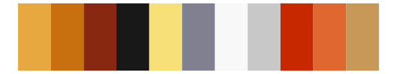

# palettetown - ampharos 

::: columns
::: {.column width="50%"}

**Github**

[timcdlucas/palettetown](https://github.com/timcdlucas/palettetown)
:::

::: {.column width="50%"}

**CRAN**

[palettetown](https://CRAN.R-project.org/package=palettetown)
:::
:::

<hr> 

Use with [paletteer](https://emilhvitfeldt.github.io/paletteer/) package:

```r
library(paletteer)
paletteer_d("palettetown::ampharos")
```

Use raw:

```r
c("#F8E848FF", "#F8C010FF", "#D09000FF", "#F8F8F8FF", "#904800FF", "#606868FF", "#E0E0E0FF", "#A8A8A8FF", "#C04000FF", "#F86000FF", "#882000FF", "#580000FF")
``` 

 

<br>

# Related Palettes

<div class="list" style="display: grid; grid-template-columns: auto auto auto;"> <figure class="figure">
<a href="../../awtools/a_palette/"> </a>
</figure> <figure class="figure">
<a href="../../palettetown/weedle/"> </a>
</figure> <figure class="figure">
<a href="../../palettetown/pichu/"> </a>
</figure> <figure class="figure">
<a href="../../palettetown/weezing/"> </a>
</figure> <figure class="figure">
<a href="../../palettetown/magmar/"> </a>
</figure> <figure class="figure">
<a href="../../palettetown/arcanine/"> </a>
</figure> <figure class="figure">
<a href="../../palettetown/octillery/"> </a>
</figure> <figure class="figure">
<a href="../../palettetown/beedrill/"> </a>
</figure> <figure class="figure">
<a href="../../palettetown/murkrow/"> </a>
</figure> <figure class="figure">
<a href="../../palettetown/magikarp/"> </a>
</figure> <figure class="figure">
<a href="../../palettetown/pidgeotto/"> </a>
</figure> <figure class="figure">
<a href="../../palettetown/quilava/"> </a>
</figure> 
</div>
