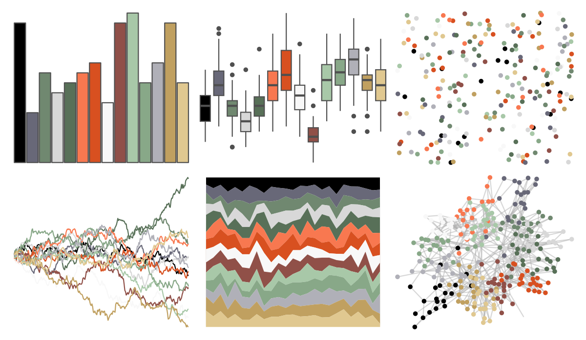
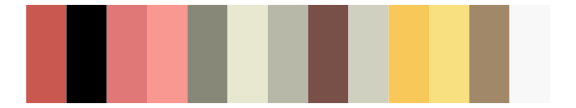

# palettetown - anorith 

::: columns
::: {.column width="50%"}

**Github**

[timcdlucas/palettetown](https://github.com/timcdlucas/palettetown)
:::

::: {.column width="50%"}

**CRAN**

[palettetown](https://CRAN.R-project.org/package=palettetown)
:::
:::

<hr> 

Use with [paletteer](https://emilhvitfeldt.github.io/paletteer/) package:

```r
library(paletteer)
paletteer_d("palettetown::anorith")
```

Use raw:

```r
c("#000000FF", "#686878FF", "#708870FF", "#D8D8D8FF", "#587058FF", "#F87850FF", "#D85020FF", "#F8F8F8FF", "#905048FF", "#A8C8A8FF", "#88A888FF", "#B0B0B8FF", "#C0A060FF", "#E0C890FF")
``` 

 

<br>

# Related Palettes

<div class="list" style="display: grid; grid-template-columns: auto auto auto;"> <figure class="figure">
<a href="../../awtools/a_palette/"> </a>
</figure> <figure class="figure">
<a href="../../palettetown/poochyena/"> </a>
</figure> <figure class="figure">
<a href="../../palettetown/duskull/"> </a>
</figure> <figure class="figure">
<a href="../../palettetown/slakoth/"> </a>
</figure> <figure class="figure">
<a href="../../palettetown/dodrio/"> </a>
</figure> <figure class="figure">
<a href="../../palettetown/medicham/"> </a>
</figure> <figure class="figure">
<a href="../../palettetown/camerupt/"> </a>
</figure> <figure class="figure">
<a href="../../palettetown/gyarados/"> </a>
</figure> <figure class="figure">
<a href="../../palettetown/primeape/"> </a>
</figure> <figure class="figure">
<a href="../../palettetown/feebas/"> </a>
</figure> <figure class="figure">
<a href="../../palettetown/armaldo/"> </a>
</figure> <figure class="figure">
<a href="../../palettetown/hariyama/"> </a>
</figure> 
</div>
