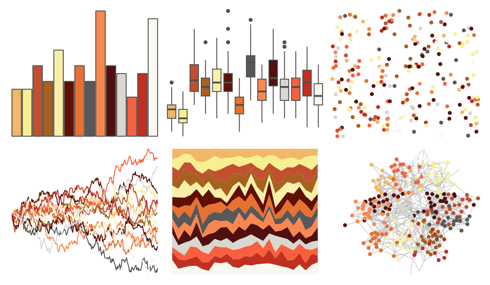
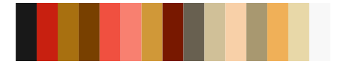

# palettetown - arcanine 

::: columns
::: {.column width="50%"}

**Github**

[timcdlucas/palettetown](https://github.com/timcdlucas/palettetown)
:::

::: {.column width="50%"}

**CRAN**

[palettetown](https://CRAN.R-project.org/package=palettetown)
:::
:::

<hr> 

Use with [paletteer](https://emilhvitfeldt.github.io/paletteer/) package:

```r
library(paletteer)
paletteer_d("palettetown::arcanine")
```

Use raw:

```r
c("#F0B868FF", "#F8F090FF", "#C05030FF", "#A86020FF", "#F8F0A8FF", "#601000FF", "#E87030FF", "#585858FF", "#F88850FF", "#501010FF", "#D8D8D0FF", "#F86040FF", "#C03020FF", "#F8F8F0FF")
``` 

 

<br>

# Related Palettes

<div class="list" style="display: grid; grid-template-columns: auto auto auto;"> <figure class="figure">
<a href="../../amerika/Dem_Ind_Rep3/"> </a>
</figure> <figure class="figure">
<a href="../../palettetown/spearow/"> </a>
</figure> <figure class="figure">
<a href="../../palettetown/ampharos/"> </a>
</figure> <figure class="figure">
<a href="../../palettetown/magmar/"> </a>
</figure> <figure class="figure">
<a href="../../palettetown/pidgeotto/"> </a>
</figure> <figure class="figure">
<a href="../../palettetown/pichu/"> </a>
</figure> <figure class="figure">
<a href="../../palettetown/octillery/"> </a>
</figure> <figure class="figure">
<a href="../../palettetown/slowpoke/"> </a>
</figure> <figure class="figure">
<a href="../../palettetown/weedle/"> </a>
</figure> <figure class="figure">
<a href="../../palettetown/charizard/"> </a>
</figure> <figure class="figure">
<a href="../../palettetown/entei/"> </a>
</figure> <figure class="figure">
<a href="../../palettetown/beedrill/"> </a>
</figure> 
</div>
