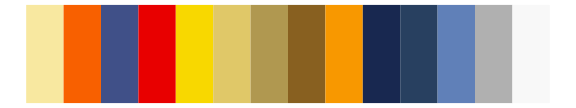

# palettetown - ariados 

::: columns
::: {.column width="50%"}

**Github**

[timcdlucas/palettetown](https://github.com/timcdlucas/palettetown)
:::

::: {.column width="50%"}

**CRAN**

[palettetown](https://CRAN.R-project.org/package=palettetown)
:::
:::

<hr> 

Use with [paletteer](https://emilhvitfeldt.github.io/paletteer/) package:

```r
library(paletteer)
paletteer_d("palettetown::ariados")
```

Use raw:

```r
c("#6830A8FF", "#F8E858FF", "#9058E8FF", "#D8B048FF", "#C85000FF", "#907030FF", "#F87828FF", "#686868FF", "#882000FF", "#F8A838FF", "#B890F8FF", "#F8F8F8FF", "#B8B8B8FF", "#480000FF")
``` 

 

<br>

# Related Palettes

<div class="list" style="display: grid; grid-template-columns: auto auto auto;"> <figure class="figure">
<a href="../../awtools/a_palette/"> </a>
</figure> <figure class="figure">
<a href="../../palettetown/jynx/"> </a>
</figure> <figure class="figure">
<a href="../../palettetown/raikou/"> </a>
</figure> <figure class="figure">
<a href="../../palettetown/gloom/"> </a>
</figure> <figure class="figure">
<a href="../../palettetown/exploud/"> </a>
</figure> <figure class="figure">
<a href="../../tidyquant/tq_green/"> </a>
</figure> <figure class="figure">
<a href="../../palettetown/miltank/"> </a>
</figure> <figure class="figure">
<a href="../../palettetown/delcatty/"> </a>
</figure> <figure class="figure">
<a href="../../palettetown/loudred/"> </a>
</figure> <figure class="figure">
<a href="../../palettetown/quilava/"> </a>
</figure> <figure class="figure">
<a href="../../palettetown/ledian/"> </a>
</figure> <figure class="figure">
<a href="../../palettetown/cyndaquil/"> </a>
</figure> 
</div>
