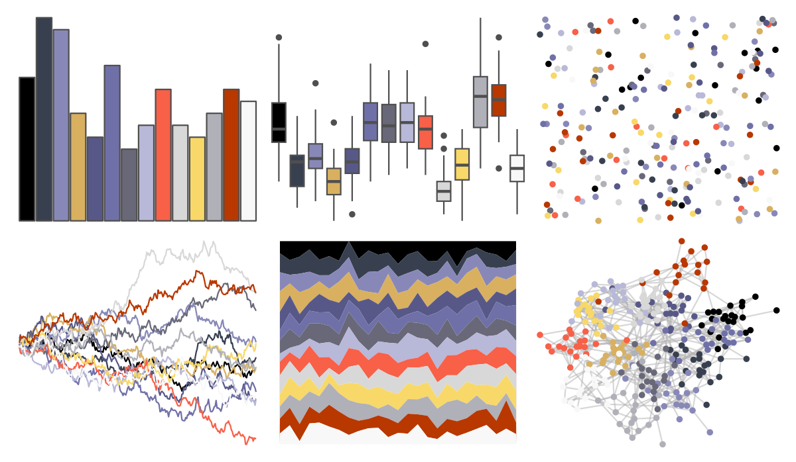

# palettetown - armaldo 

::: columns
::: {.column width="50%"}

**Github**

[timcdlucas/palettetown](https://github.com/timcdlucas/palettetown)
:::

::: {.column width="50%"}

**CRAN**

[palettetown](https://CRAN.R-project.org/package=palettetown)
:::
:::

<hr> 

Use with [paletteer](https://emilhvitfeldt.github.io/paletteer/) package:

```r
library(paletteer)
paletteer_d("palettetown::armaldo")
```

Use raw:

```r
c("#000000FF", "#384050FF", "#8888B8FF", "#D8B060FF", "#585888FF", "#7070A8FF", "#686878FF", "#B8B8D8FF", "#F86048FF", "#D8D8D8FF", "#F8D868FF", "#B0B0B8FF", "#B83800FF", "#F8F8F8FF")
``` 

 

<br>

# Related Palettes

<div class="list" style="display: grid; grid-template-columns: auto auto auto;"> <figure class="figure">
<a href="../../awtools/a_palette/"> </a>
</figure> <figure class="figure">
<a href="../../ButterflyColors/hamadryas_feronia/"> </a>
</figure> <figure class="figure">
<a href="../../ButterflyColors/hamadryas_feronia/"> </a>
</figure> <figure class="figure">
<a href="../../palettetown/poochyena/"> </a>
</figure> <figure class="figure">
<a href="../../palettetown/gyarados/"> </a>
</figure> <figure class="figure">
<a href="../../palettetown/loudred/"> </a>
</figure> <figure class="figure">
<a href="../../palettetown/swellow/"> </a>
</figure> <figure class="figure">
<a href="../../palettetown/volbeat/"> </a>
</figure> <figure class="figure">
<a href="../../palettetown/exploud/"> </a>
</figure> <figure class="figure">
<a href="../../palettetown/taillow/"> </a>
</figure> <figure class="figure">
<a href="../../palettetown/slaking/"> </a>
</figure> <figure class="figure">
<a href="../../palettetown/sharpedo/"> </a>
</figure> 
</div>
