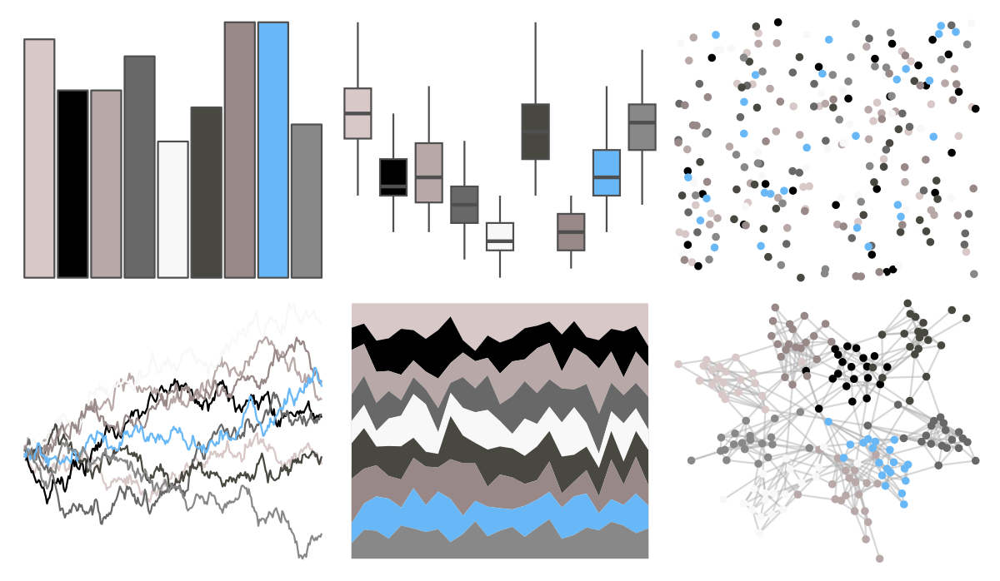

# palettetown - aron 

::: columns
::: {.column width="50%"}

**Github**

[timcdlucas/palettetown](https://github.com/timcdlucas/palettetown)
:::

::: {.column width="50%"}

**CRAN**

[palettetown](https://CRAN.R-project.org/package=palettetown)
:::
:::

<hr> 

Use with [paletteer](https://emilhvitfeldt.github.io/paletteer/) package:

```r
library(paletteer)
paletteer_d("palettetown::aron")
```

Use raw:

```r
c("#D8C8C8FF", "#000000FF", "#B8A8A8FF", "#686868FF", "#F8F8F8FF", "#484840FF", "#988888FF", "#68B8F8FF", "#888888FF")
``` 

 

<br>

# Related Palettes

<div class="list" style="display: grid; grid-template-columns: auto auto auto;"> <figure class="figure">
<a href="../../amerika/Dem_Ind_Rep3/"> </a>
</figure> <figure class="figure">
<a href="../../palettetown/lairon/"> </a>
</figure> <figure class="figure">
<a href="../../palettetown/aggron/"> </a>
</figure> <figure class="figure">
<a href="../../unikn/pal_unikn_ppt/"> </a>
</figure> <figure class="figure">
<a href="../../palettetown/absol/"> </a>
</figure> <figure class="figure">
<a href="../../palettetown/registeel/"> </a>
</figure> <figure class="figure">
<a href="../../unikn/pal_unikn/"> </a>
</figure> <figure class="figure">
<a href="../../unikn/pal_unikn_web/"> </a>
</figure> <figure class="figure">
<a href="../../palettetown/spoink/"> </a>
</figure> <figure class="figure">
<a href="../../palettetown/slakoth/"> </a>
</figure> <figure class="figure">
<a href="../../palettetown/barboach/"> </a>
</figure> <figure class="figure">
<a href="../../palettetown/slaking/"> </a>
</figure> 
</div>
