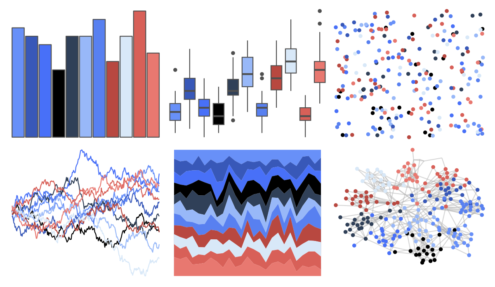
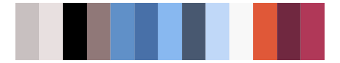
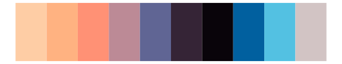

# palettetown - azurill 

::: columns
::: {.column width="50%"}

**Github**

[timcdlucas/palettetown](https://github.com/timcdlucas/palettetown)
:::

::: {.column width="50%"}

**CRAN**

[palettetown](https://CRAN.R-project.org/package=palettetown)
:::
:::

<hr> 

Use with [paletteer](https://emilhvitfeldt.github.io/paletteer/) package:

```r
library(paletteer)
paletteer_d("palettetown::azurill")
```

Use raw:

```r
c("#6890F8FF", "#3858B8FF", "#4870F8FF", "#000000FF", "#304058FF", "#98B8F8FF", "#5880F0FF", "#B84840FF", "#D8E8F8FF", "#D86058FF", "#E87870FF")
``` 

 

<br>

# Related Palettes

<div class="list" style="display: grid; grid-template-columns: auto auto auto;"> <figure class="figure">
<a href="../../awtools/a_palette/"> </a>
</figure> <figure class="figure">
<a href="../../palettetown/sableye/"> </a>
</figure> <figure class="figure">
<a href="../../palettetown/meditite/"> </a>
</figure> <figure class="figure">
<a href="../../peRReo/badgyal/"> </a>
</figure> <figure class="figure">
<a href="../../palettetown/porygon/"> </a>
</figure> <figure class="figure">
<a href="../../palettetown/clamperl/"> </a>
</figure> <figure class="figure">
<a href="../../palettetown/haunter/"> </a>
</figure> <figure class="figure">
<a href="../../palettetown/salamence/"> </a>
</figure> <figure class="figure">
<a href="../../palettetown/wynaut/"> </a>
</figure> <figure class="figure">
<a href="../../palettetown/gorebyss/"> </a>
</figure> <figure class="figure">
<a href="../../tvthemes/Sardonyx/"> </a>
</figure> <figure class="figure">
<a href="../../werpals/uyuni/"> </a>
</figure> 
</div>
