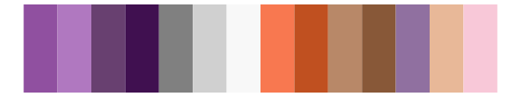

# palettetown - bagon 

::: columns
::: {.column width="50%"}

**Github**

[timcdlucas/palettetown](https://github.com/timcdlucas/palettetown)
:::

::: {.column width="50%"}

**CRAN**

[palettetown](https://CRAN.R-project.org/package=palettetown)
:::
:::

<hr> 

Use with [paletteer](https://emilhvitfeldt.github.io/paletteer/) package:

```r
library(paletteer)
paletteer_d("palettetown::bagon")
```

Use raw:

```r
c("#7878D8FF", "#484860FF", "#787090FF", "#A8A8F8FF", "#D8D0E8FF", "#181818FF", "#A8A0B8FF", "#C08060FF", "#809090FF", "#F89060FF", "#F8F8F8FF")
``` 

 

<br>

# Related Palettes

<div class="list" style="display: grid; grid-template-columns: auto auto auto;"> <figure class="figure">
<a href="../../awtools/a_palette/"> </a>
</figure> <figure class="figure">
<a href="../../palettetown/salamence/"> </a>
</figure> <figure class="figure">
<a href="../../palettetown/slaking/"> </a>
</figure> <figure class="figure">
<a href="../../palettetown/venonat/"> </a>
</figure> <figure class="figure">
<a href="../../palettetown/huntail/"> </a>
</figure> <figure class="figure">
<a href="../../palettetown/meditite/"> </a>
</figure> <figure class="figure">
<a href="../../palettetown/gengar/"> </a>
</figure> <figure class="figure">
<a href="../../palettetown/armaldo/"> </a>
</figure> <figure class="figure">
<a href="../../palettetown/nosepass/"> </a>
</figure> <figure class="figure">
<a href="../../palettetown/tyrogue/"> </a>
</figure> <figure class="figure">
<a href="../../palettetown/mr_mime/"> </a>
</figure> <figure class="figure">
<a href="../../palettetown/registeel/"> </a>
</figure> 
</div>
