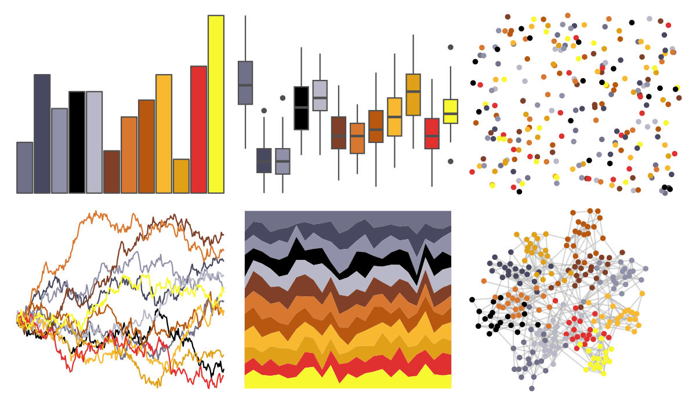

# palettetown - banette 

::: columns
::: {.column width="50%"}

**Github**

[timcdlucas/palettetown](https://github.com/timcdlucas/palettetown)
:::

::: {.column width="50%"}

**CRAN**

[palettetown](https://CRAN.R-project.org/package=palettetown)
:::
:::

<hr> 

Use with [paletteer](https://emilhvitfeldt.github.io/paletteer/) package:

```r
library(paletteer)
paletteer_d("palettetown::banette")
```

Use raw:

```r
c("#707088FF", "#484860FF", "#9090A8FF", "#000000FF", "#B8B8C8FF", "#804028FF", "#D87830FF", "#B85810FF", "#F8B830FF", "#E0A018FF", "#E03030FF", "#F8F830FF")
``` 

 

<br>

# Related Palettes

<div class="list" style="display: grid; grid-template-columns: auto auto auto;"> <figure class="figure">
<a href="../../amerika/Dem_Ind_Rep3/"> </a>
</figure> <figure class="figure">
<a href="../../palettetown/makuhita/"> </a>
</figure> <figure class="figure">
<a href="../../palettetown/crawdaunt/"> </a>
</figure> <figure class="figure">
<a href="../../palettetown/poochyena/"> </a>
</figure> <figure class="figure">
<a href="../../palettetown/lileep/"> </a>
</figure> <figure class="figure">
<a href="../../palettetown/ampharos/"> </a>
</figure> <figure class="figure">
<a href="../../palettetown/blaziken/"> </a>
</figure> <figure class="figure">
<a href="../../palettetown/ninjask/"> </a>
</figure> <figure class="figure">
<a href="../../palettetown/weedle/"> </a>
</figure> <figure class="figure">
<a href="../../MexBrewer/Atentado/"> </a>
</figure> <figure class="figure">
<a href="../../palettetown/beedrill/"> </a>
</figure> <figure class="figure">
<a href="../../palettetown/loudred/"> </a>
</figure> 
</div>
