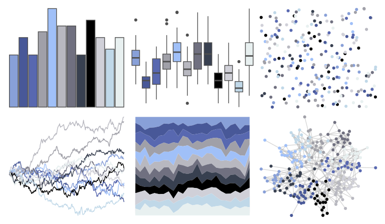

# palettetown - barboach 

::: columns
::: {.column width="50%"}

**Github**

[timcdlucas/palettetown](https://github.com/timcdlucas/palettetown)
:::

::: {.column width="50%"}

**CRAN**

[palettetown](https://CRAN.R-project.org/package=palettetown)
:::
:::

<hr> 

Use with [paletteer](https://emilhvitfeldt.github.io/paletteer/) package:

```r
library(paletteer)
paletteer_d("palettetown::barboach")
```

Use raw:

```r
c("#88A0D8FF", "#485898FF", "#5868B0FF", "#A0A0A8FF", "#A0C0F8FF", "#B8B8C0FF", "#707080FF", "#384050FF", "#000000FF", "#D0D0D8FF", "#C0D8E8FF", "#E8F0F0FF")
``` 

 

<br>

# Related Palettes

<div class="list" style="display: grid; grid-template-columns: auto auto auto;"> <figure class="figure">
<a href="../../awtools/a_palette/"> </a>
</figure> <figure class="figure">
<a href="../../palettetown/swablu/"> </a>
</figure> <figure class="figure">
<a href="../../palettetown/altaria/"> </a>
</figure> <figure class="figure">
<a href="../../palettetown/glalie/"> </a>
</figure> <figure class="figure">
<a href="../../palettetown/mantine/"> </a>
</figure> <figure class="figure">
<a href="../../palettetown/lairon/"> </a>
</figure> <figure class="figure">
<a href="../../palettetown/sealeo/"> </a>
</figure> <figure class="figure">
<a href="../../palettetown/remoraid/"> </a>
</figure> <figure class="figure">
<a href="../../palettetown/dragonair/"> </a>
</figure> <figure class="figure">
<a href="../../beyonce/X77/"> </a>
</figure> <figure class="figure">
<a href="../../palettetown/aron/"> </a>
</figure> <figure class="figure">
<a href="../../palettetown/clamperl/"> </a>
</figure> 
</div>
