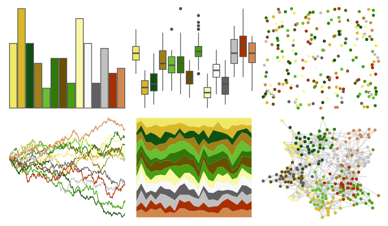

# palettetown - bayleef 

::: columns
::: {.column width="50%"}

**Github**

[timcdlucas/palettetown](https://github.com/timcdlucas/palettetown)
:::

::: {.column width="50%"}

**CRAN**

[palettetown](https://CRAN.R-project.org/package=palettetown)
:::
:::

<hr> 

Use with [paletteer](https://emilhvitfeldt.github.io/paletteer/) package:

```r
library(paletteer)
paletteer_d("palettetown::bayleef")
```

Use raw:

```r
c("#F0E868FF", "#D8B828FF", "#105010FF", "#A08018FF", "#68C030FF", "#307808FF", "#685000FF", "#48A010FF", "#F8F8A8FF", "#F8F8F8FF", "#606060FF", "#C0C0C0FF", "#A83000FF", "#D08850FF")
``` 

 

<br>

# Related Palettes

<div class="list" style="display: grid; grid-template-columns: auto auto auto;"> <figure class="figure">
<a href="../../awtools/a_palette/"> </a>
</figure> <figure class="figure">
<a href="../../palettetown/exeggutor/"> </a>
</figure> <figure class="figure">
<a href="../../palettetown/hoothoot/"> </a>
</figure> <figure class="figure">
<a href="../../palettetown/treecko/"> </a>
</figure> <figure class="figure">
<a href="../../palettetown/ho_oh/"> </a>
</figure> <figure class="figure">
<a href="../../palettetown/spinarak/"> </a>
</figure> <figure class="figure">
<a href="../../palettetown/politoed/"> </a>
</figure> <figure class="figure">
<a href="../../palettetown/ludicolo/"> </a>
</figure> <figure class="figure">
<a href="../../palettetown/caterpie/"> </a>
</figure> <figure class="figure">
<a href="../../palettetown/bellossom/"> </a>
</figure> <figure class="figure">
<a href="../../palettetown/golem/"> </a>
</figure> <figure class="figure">
<a href="../../palettetown/natu/"> </a>
</figure> 
</div>
